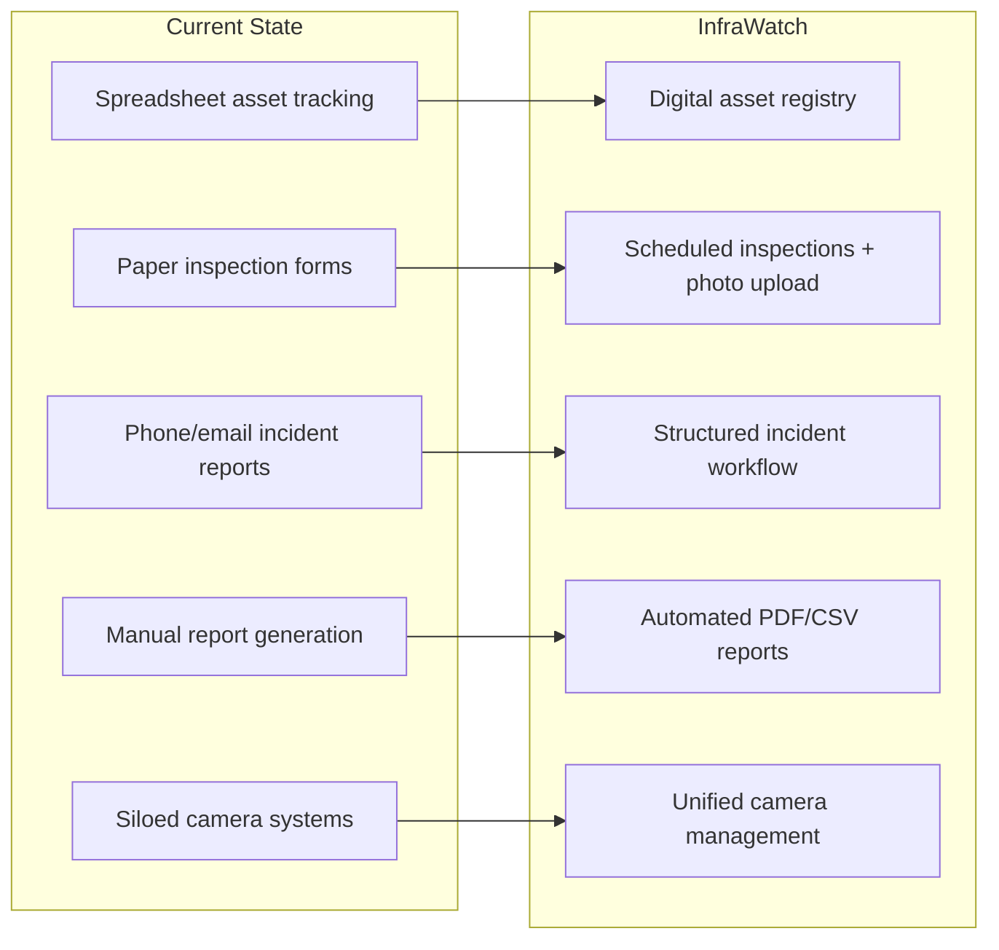
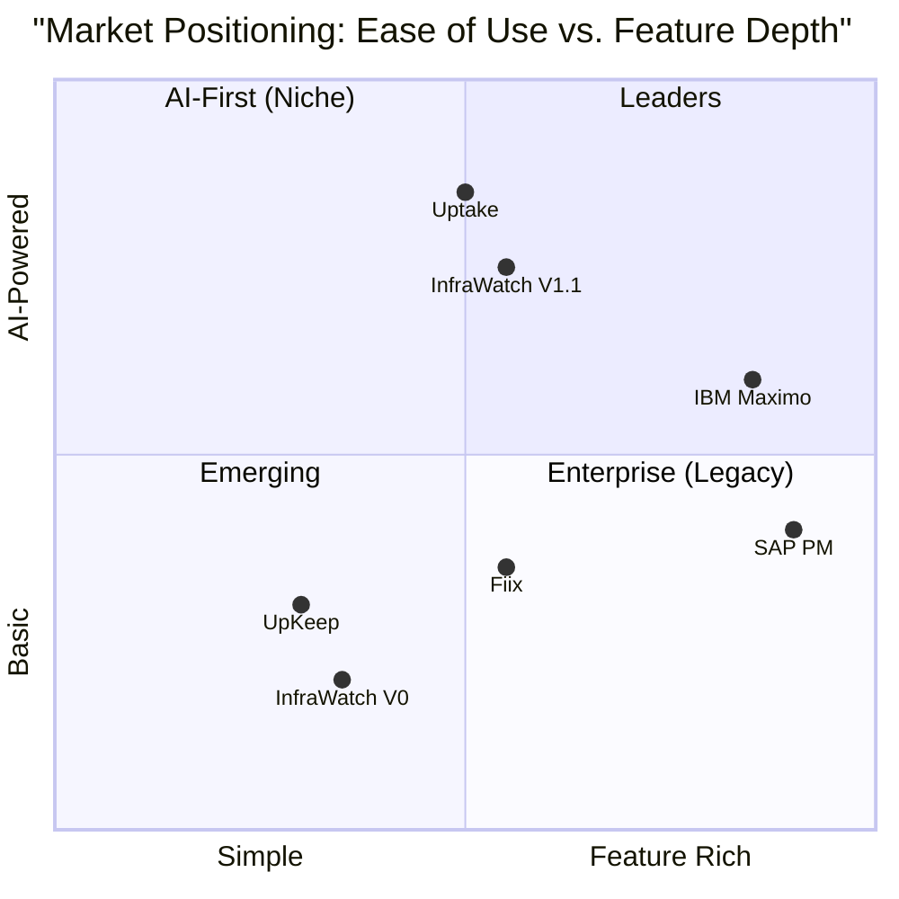
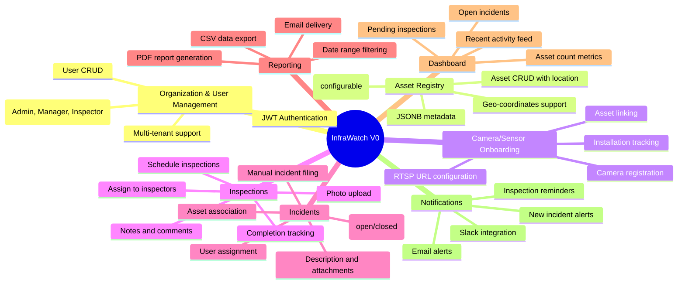
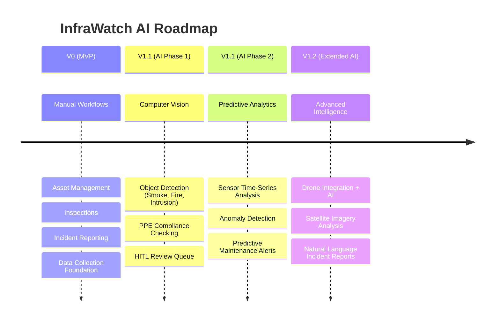
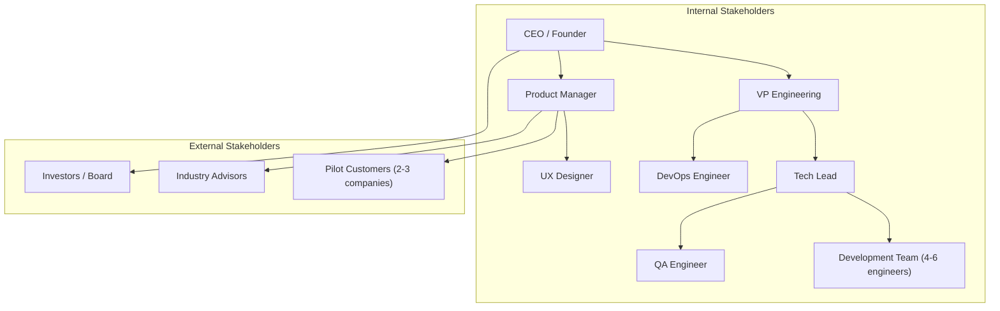

# Product Vision & Scope

> **IEKB Section:** 00 — Foundation & Overview  
> **Document:** 01-product-vision.md  
> **Last Updated:** 2026-07-16  
> **Owner:** Product Team  
> **Status:** Approved

---

## Table of Contents

1. [Executive Summary](#executive-summary)
2. [Product Vision Statement](#product-vision-statement)
3. [Mission Statement](#mission-statement)
4. [Problem Statement](#problem-statement)
5. [Target Market & Personas](#target-market--personas)
6. [Competitive Landscape](#competitive-landscape)
7. [Value Proposition](#value-proposition)
8. [Product Scope — V0 MVP](#product-scope--v0-mvp)
9. [Feature Inventory — V0](#feature-inventory--v0)
10. [V1.1 AI Roadmap](#v11-ai-roadmap)
11. [Product Principles](#product-principles)
12. [Success Metrics](#success-metrics)
13. [Stakeholder Map](#stakeholder-map)
14. [Business Model](#business-model)
15. [Related Documents](#related-documents)

---

## Executive Summary

InfraWatch is a **multi-tenant SaaS platform** designed for infrastructure monitoring, asset management, and incident response workflows. It serves engineering teams, facility managers, and field inspectors responsible for maintaining physical infrastructure such as towers, solar panels, industrial machinery, pipelines, and construction sites.

**V0 (MVP)** delivers the foundational workflows — asset registration, camera/sensor onboarding, inspection scheduling, manual incident reporting, reporting, and multi-tenant administration — entirely without AI. This deliberate scoping ensures the team ships a stable, well-tested product that validates core business workflows before layering in automation.

**V1.1** introduces AI-powered features: computer vision for object detection (smoke, fire, intrusion), PPE compliance checking, and predictive analytics from sensor time-series data. The V0 architecture explicitly prepares for these capabilities through extensible data contracts and microservice boundaries.

---

## Product Vision Statement

> **"Empower infrastructure teams to prevent failures before they become disasters — starting with visibility, evolving through intelligence."**

InfraWatch envisions a world where every piece of physical infrastructure — from a cellular tower in a rural area to a solar farm spanning hundreds of acres — is continuously monitored, systematically inspected, and proactively maintained. The platform replaces fragmented spreadsheets, paper forms, and ad-hoc communication with a unified system that grows from manual workflows to AI-augmented decision-making.

---

## Mission Statement

> **"To deliver the simplest, most reliable infrastructure monitoring platform that scales from a single facility to a global portfolio — accessible to every inspector, manager, and executive who depends on physical assets."**

### Mission Pillars

1. **Simplicity First** — Every workflow should be completable in fewer steps than the current manual process.
2. **Reliability Over Features** — A stable system with core features beats a fragile system with many.
3. **Field-Ready** — Inspectors in the field, often with limited connectivity, must be first-class users.
4. **Data-Driven Growth** — Every interaction captures structured data that enables future AI capabilities.
5. **Multi-Tenant Security** — Tenant data isolation is non-negotiable; one customer's data is never visible to another.

---

## Problem Statement

### Industry Pain Points

Organizations managing physical infrastructure face systemic challenges:

#### 1. Fragmented Visibility
- Asset inventories live in spreadsheets, legacy systems, or tribal knowledge
- Camera/sensor systems operate in silos with no central dashboard
- Management lacks real-time awareness of infrastructure health

#### 2. Reactive Maintenance Culture
- Inspections are paper-based or email-driven, leading to missed schedules
- Incidents are reported through phone calls, text messages, or manual emails
- No structured workflow from detection → reporting → resolution → postmortem

#### 3. Compliance & Audit Gaps
- Regulatory inspections require documented evidence trails
- Historical data is scattered across filing cabinets and email archives
- Generating compliance reports takes days of manual data collection

#### 4. Scale Without Systems
- As portfolios grow (more sites, more assets), manual processes break down
- No standardized way to onboard new sites or train new inspectors
- Video surveillance footage is reviewed only after incidents, not proactively

#### 5. Technology Adoption Barriers
- Existing monitoring solutions are enterprise-grade and expensive ($50K+/year)
- Configuration is complex, requiring dedicated IT staff
- No mobile-first experience for field workers

### The InfraWatch Opportunity

InfraWatch addresses these pain points by providing:



---

## Target Market & Personas

### Primary Market Segments

| Segment | Company Size | Assets | Annual Revenue | Pain Level |
|---------|-------------|--------|---------------|------------|
| **Telecom Tower Operators** | 50-500 employees | 100-10,000 towers | $10M-$500M | 🔴 High |
| **Solar/Wind Farm Operators** | 20-200 employees | 50-5,000 panels/turbines | $5M-$200M | 🔴 High |
| **Construction Companies** | 100-1,000 employees | 10-50 active sites | $20M-$1B | 🟡 Medium-High |
| **Facility Management Firms** | 50-500 employees | 20-200 buildings | $10M-$300M | 🟡 Medium-High |
| **Industrial Manufacturing** | 200-5,000 employees | 500-50,000 machines | $50M-$5B | 🟡 Medium |
| **Municipal Infrastructure** | Government agencies | Bridges, roads, utilities | Varies | 🟠 Medium |

### User Personas

#### Persona 1: The Infrastructure Admin (Primary)

```
Name:         Rajesh Patel
Title:        Infrastructure Operations Manager
Company:      TowerNet Communications (500 towers across 3 states)
Age:          38
Tech Savvy:   Medium
Pain Points:  
  - Manages tower inventory in Excel
  - Receives incident reports via WhatsApp
  - Spends 2 days/month compiling reports for management
  - Has 15 field inspectors with no standardized reporting
Goals:
  - Single dashboard showing all tower health
  - Standardized inspection workflow
  - Automated report generation
  - Mobile access for field team
Frustrations:
  - "I spend more time tracking who inspected what than actually managing infrastructure"
  - "When something breaks, I find out from the customer, not our own systems"
```

#### Persona 2: The Field Inspector

```
Name:         Priya Sharma  
Title:        Senior Field Technician
Company:      TowerNet Communications
Age:          29
Tech Savvy:   Medium-Low (mobile-first)
Pain Points:
  - Fills out paper forms during site visits
  - Takes photos on personal phone, emails them later
  - Often forgets to report minor issues
  - No visibility into which sites need urgent attention
Goals:
  - Mobile app to log inspections on-site
  - Easy photo upload during inspection
  - Clear task list of assigned inspections
  - Quick incident reporting from the field
Frustrations:
  - "I visit 3 sites per day. Paperwork takes more time than the actual inspection"
  - "I reported a crack in tower T-142 two months ago. Nobody acknowledged it"
```

#### Persona 3: The Executive

```
Name:         Ananya Krishnan
Title:        VP of Operations
Company:      TowerNet Communications
Age:          45
Tech Savvy:   Low (needs dashboard-level visibility)
Pain Points:
  - No real-time visibility into infrastructure health
  - Monthly reports arrive late and incomplete
  - Compliance audits are stressful
  - Cannot justify maintenance budgets without data
Goals:
  - Executive dashboard with key metrics
  - Downloadable reports for board presentations
  - Compliance-ready audit trails
  - Trend analysis over time
Frustrations:
  - "I make million-dollar maintenance decisions based on gut feeling because we don't have data"
```

#### Persona 4: The Organization Admin (Technical)

```
Name:         Dev Kapoor
Title:        IT Administrator
Company:      TowerNet Communications
Age:          32
Tech Savvy:   High
Pain Points:
  - Managing user access across multiple systems
  - Integrating camera systems from different vendors
  - No centralized logging of who did what
Goals:
  - Centralized user management with roles
  - Easy camera/sensor onboarding
  - Audit logs for compliance
  - API access for custom integrations
```

---

## Competitive Landscape

### Market Overview

The infrastructure monitoring market includes established enterprise players and emerging niche solutions:

| Competitor | Type | Strengths | Weaknesses | Pricing |
|-----------|------|-----------|------------|---------|
| **IBM Maximo** | Enterprise APM | Deep asset management, analytics | Complex, expensive, requires consultants | $100K+/year |
| **SAP PM** | Enterprise ERP Module | Integration with ERP, mature | Heavy, not standalone, SAP ecosystem lock-in | $50K+/year |
| **Uptake** | AI-focused | Strong predictive analytics | Requires significant data history | $30K+/year |
| **Fiix (by Rockwell)** | CMMS | User-friendly, good mobile | Limited infrastructure focus | $40-100/user/mo |
| **UpKeep** | Mobile-first CMMS | Excellent mobile UX | Limited multi-tenant, basic analytics | $35-75/user/mo |
| **Custom Spreadsheets** | DIY | Free, familiar | No workflow, no collaboration, no audit trail | Free |

### InfraWatch Competitive Positioning



### InfraWatch Differentiators

1. **Purpose-built for infrastructure monitoring** — Not a generic CMMS adapted for infrastructure
2. **Multi-tenant SaaS from day one** — Built for scale, not retrofitted
3. **AI-ready architecture** — V0 captures the data that V1.1's AI will use
4. **Mobile-first field experience** — Designed for inspectors in the field
5. **Transparent, affordable pricing** — Per-user pricing accessible to mid-market
6. **API-first** — Every feature accessible via REST API for custom integrations

---

## Value Proposition

### For Infrastructure Operators

> **"Replace fragmented spreadsheets and phone calls with a unified platform that gives you real-time visibility into every asset, every inspection, and every incident — then use AI to predict problems before they happen."**

### Value Quantification

| Metric | Before InfraWatch | With InfraWatch V0 | With InfraWatch V1.1 |
|--------|-------------------|--------------------|-----------------------|
| **Time to file incident** | 30-60 minutes | 2-5 minutes | Automated (AI) |
| **Inspection compliance rate** | ~60% | ~95% | ~99% |
| **Report generation time** | 1-2 days | < 1 minute | Real-time dashboards |
| **Incident detection time** | Hours to days | Minutes (manual) | Seconds (AI) |
| **Asset visibility** | Partial (spreadsheets) | Complete | Complete + predictive |
| **Audit readiness** | Weeks of prep | Always ready | Always ready |

---

## Product Scope — V0 MVP

### In-Scope Features

V0 delivers the complete manual workflow — every feature an infrastructure team needs to replace spreadsheets and paper forms with structured digital workflows.



### Explicitly Out-of-Scope for V0

The following features are **deliberately excluded** from V0 to prevent scope creep:

| Feature | Reason for Exclusion | Planned Version |
|---------|---------------------|-----------------|
| AI object detection (smoke, fire) | Requires ML infrastructure | V1.1 |
| PPE compliance detection | Requires computer vision models | V1.1 |
| Predictive analytics | Requires historical data accumulation | V1.1 |
| Live video streaming | Requires WebRTC/RTSP proxy infrastructure | V1.1 |
| IoT sensor integration | Requires IoT gateway and protocols (MQTT) | V1.1 |
| Drone integration | Requires drone SDK and flight planning | V1.2 |
| Satellite imagery | Requires GIS and satellite data partnerships | V1.2 |
| Mobile native app (iOS/Android) | PWA covers V0; native for offline mode | V1.1 |
| Multi-language support (i18n) | English-only for V0 | V1.0 |
| White-label/custom domains | Requires DNS and certificate automation | V1.2 |
| Marketplace/plugin system | Too early for extensibility architecture | V2.0 |

---

## Feature Inventory — V0

### Feature Detail Matrix

| ID | Feature | Module | Priority | Complexity | Sprint | User Stories |
|----|---------|--------|----------|------------|--------|-------------|
| F-001 | Organization creation | Org/User | P0 - Must | Low | Sprint 1 | 3 |
| F-002 | User registration & login | Auth | P0 - Must | Medium | Sprint 1 | 5 |
| F-003 | JWT token management | Auth | P0 - Must | Medium | Sprint 1 | 3 |
| F-004 | Role-based access control | Auth | P0 - Must | High | Sprint 1 | 8 |
| F-005 | User profile management | Org/User | P1 - Should | Low | Sprint 1 | 3 |
| F-006 | Asset type configuration | Assets | P0 - Must | Low | Sprint 2 | 2 |
| F-007 | Asset CRUD operations | Assets | P0 - Must | Medium | Sprint 2 | 6 |
| F-008 | Asset location (geo) | Assets | P1 - Should | Medium | Sprint 2 | 3 |
| F-009 | Camera registration | Cameras | P0 - Must | Medium | Sprint 2 | 4 |
| F-010 | Camera-asset linking | Cameras | P0 - Must | Low | Sprint 2 | 2 |
| F-011 | Inspection creation | Inspections | P0 - Must | Medium | Sprint 3 | 4 |
| F-012 | Inspection scheduling | Inspections | P0 - Must | Medium | Sprint 3 | 3 |
| F-013 | Inspection photo upload | Inspections | P0 - Must | High | Sprint 3 | 4 |
| F-014 | Inspection completion | Inspections | P0 - Must | Low | Sprint 3 | 2 |
| F-015 | Incident reporting | Incidents | P0 - Must | Medium | Sprint 3 | 5 |
| F-016 | Incident status workflow | Incidents | P0 - Must | Medium | Sprint 3 | 4 |
| F-017 | Incident assignment | Incidents | P1 - Should | Low | Sprint 3 | 2 |
| F-018 | PDF report generation | Reports | P0 - Must | High | Sprint 4 | 3 |
| F-019 | CSV data export | Reports | P1 - Should | Low | Sprint 4 | 2 |
| F-020 | Dashboard metrics | Dashboard | P0 - Must | Medium | Sprint 4 | 5 |
| F-021 | Recent activity feed | Dashboard | P1 - Should | Medium | Sprint 4 | 2 |
| F-022 | Email notifications | Notifications | P1 - Should | Medium | Sprint 4 | 4 |
| F-023 | Slack notifications | Notifications | P2 - Could | Medium | Sprint 4 | 2 |
| F-024 | Mobile-responsive UI | Frontend | P0 - Must | High | All Sprints | — |
| F-025 | Settings page | Admin | P1 - Should | Low | Sprint 4 | 3 |

### Total Story Points Estimate

| Sprint | Features | Story Points (est.) | Risk |
|--------|----------|--------------------|-|
| Sprint 1 | F-001 through F-005 | 55 | Low |
| Sprint 2 | F-006 through F-010 | 45 | Low |
| Sprint 3 | F-011 through F-017 | 65 | Medium |
| Sprint 4 | F-018 through F-025 | 50 | Medium |
| **Total** | **25 features** | **215** | — |

---

## V1.1 AI Roadmap

### AI Feature Overview

V1.1 introduces AI capabilities that leverage the data captured in V0:



### AI Features Detail

| Feature | Data Dependency | Model Type | Input | Output | Confidence Threshold |
|---------|----------------|------------|-------|--------|---------------------|
| **Object Detection** | Camera images stored in V0 | YOLOv8 / EfficientDet | Camera frames (JPEG) | Bounding boxes + labels | 85% |
| **PPE Compliance** | Inspection photos from V0 | Custom CNN classifier | Worker images | Compliant/Non-compliant + items | 90% |
| **Anomaly Detection** | Sensor time-series (future) | LSTM / Prophet | Numeric sensor streams | Anomaly score + forecast | 80% |

### V0 → V1.1 Data Bridge

V0 is designed to capture data in formats that V1.1's AI can directly consume:

| V0 Data | V0 Storage | V1.1 AI Consumer |
|---------|-----------|------------------|
| Inspection photos | S3 (`/inspections/{id}/images/`) | Object detection, PPE compliance |
| Camera metadata | PostgreSQL (`cameras` table) | Video stream routing |
| Incident reports | PostgreSQL (`incidents` table) | Training labels for anomaly models |
| Asset geo-coordinates | PostgreSQL (`assets` table) | Spatial analysis, drone routing |
| Camera config (RTSP) | PostgreSQL (`cameras` table) | Live feed inference pipeline |

---

## Product Principles

### Core Principles

1. **Workflows Before Features**
   - Focus on complete end-to-end workflows rather than isolated features
   - An inspector should be able to: arrive at site → open app → see assigned inspections → complete inspection with photos → file incident if needed → all in under 5 minutes

2. **Data Integrity Over Convenience**
   - Every action creates a structured record
   - Timestamps, user IDs, and tenant context on every mutation
   - No "soft" data entry — if a field matters, it's required

3. **Progressive Disclosure**
   - Simple defaults for new users
   - Advanced features discoverable but not overwhelming
   - Admin settings don't clutter the inspector's experience

4. **Offline-Aware Design**
   - Field inspectors may have limited connectivity
   - V0: Mobile-responsive web app with optimistic UI patterns
   - V1.1: PWA with service worker caching and offline queue

5. **API as the Product**
   - Every UI action goes through the same API a third-party integrator would use
   - No backdoor database queries from the frontend
   - API documentation is a first-class deliverable

6. **Security as Architecture, Not Afterthought**
   - Multi-tenancy isolation is enforced at every layer (API, service, database)
   - Authentication and authorization are infrastructure, not feature code
   - Audit logging captures every mutation for compliance

---

## Success Metrics

### V0 Launch Criteria (MVP)

| Metric | Target | Measurement |
|--------|--------|-------------|
| **Core Feature Completion** | 100% of P0 features shipped | Feature checklist |
| **Test Coverage** | ≥80% backend, ≥70% frontend | Jest/Vitest coverage reports |
| **API Response Time (p95)** | <500ms for CRUD operations | Load test results |
| **Zero Critical Bugs** | No P0/P1 bugs at launch | Bug tracker |
| **Security Audit Pass** | No critical/high vulnerabilities | OWASP ZAP scan + manual review |
| **Multi-tenant Isolation** | Zero cross-tenant data leaks | Penetration test results |
| **Documentation** | 100% API endpoints documented | OpenAPI spec completeness |
| **Uptime (staging)** | ≥99.5% over beta period | Monitoring dashboards |

### V0 Post-Launch KPIs (First 90 Days)

| KPI | Target | Frequency |
|-----|--------|-----------|
| **Monthly Active Users (MAU)** | 50+ across 5+ tenants | Monthly |
| **Inspections Completed** | 200+ per month | Monthly |
| **Incidents Reported** | 50+ per month | Monthly |
| **Reports Generated** | 30+ per month | Monthly |
| **User Retention (Day 30)** | ≥60% | Monthly |
| **NPS Score** | ≥30 | Quarterly |
| **Support Tickets** | <20 per month | Monthly |
| **API Availability** | ≥99.5% | Weekly |

---

## Stakeholder Map



### RACI Matrix

| Decision Area | CEO | VP Eng | PM | Tech Lead | Dev Team |
|--------------|-----|--------|-----|-----------|----------|
| Product scope | C | I | **A/R** | C | I |
| Architecture decisions | I | **A** | C | **R** | C |
| Sprint priorities | I | C | **A/R** | C | I |
| Technology choices | I | **A** | I | **R** | C |
| UX design | I | I | **A** | C | **R** |
| Security policies | C | **A** | I | **R** | I |
| Go/no-go launch | **A** | **R** | **R** | C | I |

*A = Accountable, R = Responsible, C = Consulted, I = Informed*

---

## Business Model

### Pricing Strategy (Planned)

| Tier | Monthly Price | Users | Assets | Features |
|------|--------------|-------|--------|----------|
| **Starter** | $29/user/mo | Up to 10 | Up to 100 | Core features, 5GB storage |
| **Professional** | $59/user/mo | Up to 50 | Up to 1,000 | All V0 features, 50GB storage, Slack integration |
| **Enterprise** | Custom | Unlimited | Unlimited | All features, SSO, SLA, dedicated support |
| **V1.1 AI Add-on** | +$20/user/mo | — | — | AI detection, predictive analytics, HITL review |

### Revenue Projections (Year 1)

| Quarter | Tenants | Avg Users/Tenant | Revenue (Monthly) |
|---------|---------|-----------------|-------------------|
| Q1 (Beta) | 3-5 | 10 | $0 (free beta) |
| Q2 | 10-15 | 15 | $8,700-$13,050 |
| Q3 | 25-35 | 20 | $29,000-$40,600 |
| Q4 | 50-75 | 25 | $72,500-$108,750 |

---

## Related Documents

- **Next:** [Glossary](./02-glossary.md) — Definitions of all terms used throughout the IEKB
- **Architecture:** [Architecture Overview](./03-architecture-overview.md) — Technical architecture diagrams and component breakdown
- **Roadmap:** [Sprint Planning](../13-project-management/01-sprint-1-plan.md) — Detailed sprint-by-sprint delivery plan
- **Index:** [IEKB Master Index](./00-IEKB-index.md) — Navigation hub for all documents

