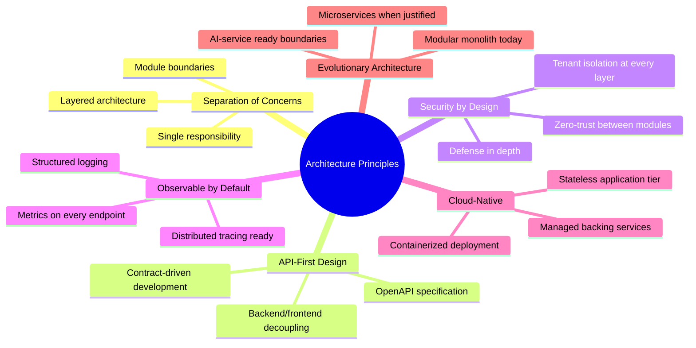
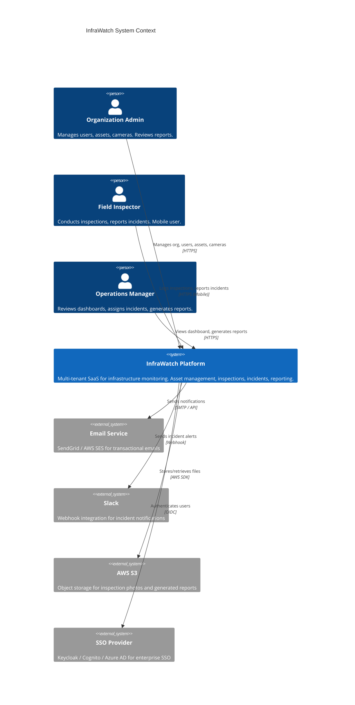
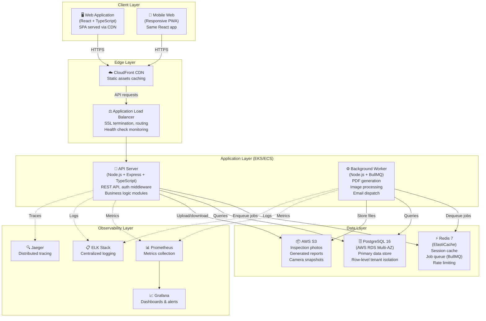
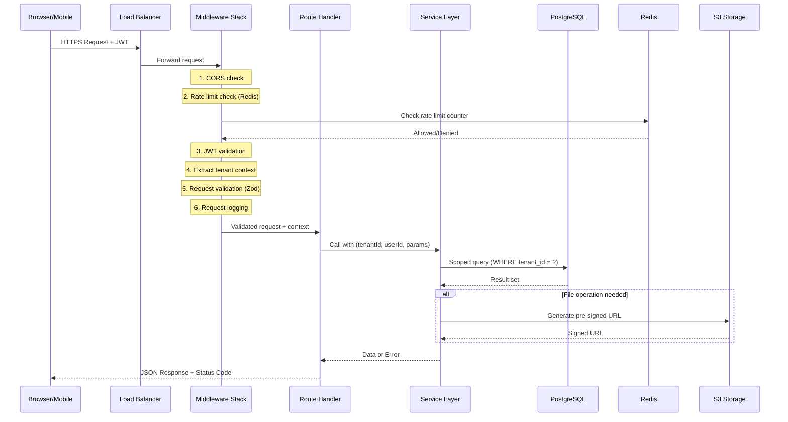
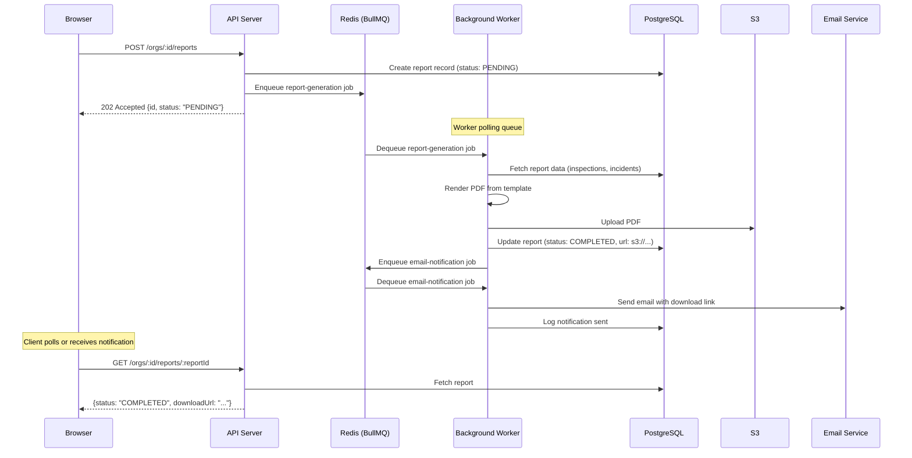
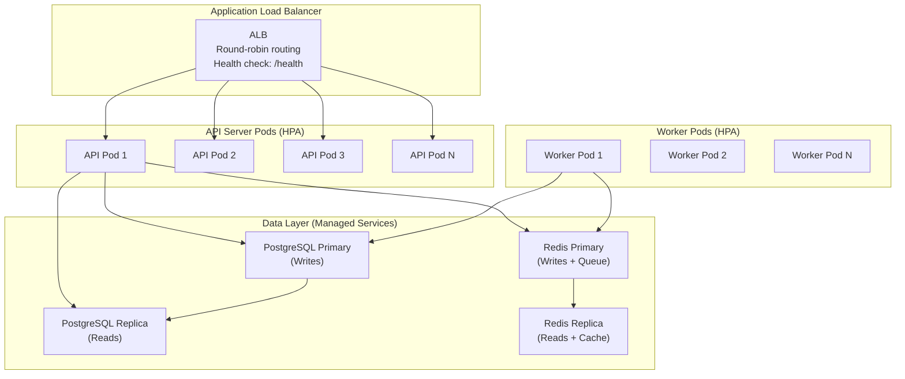
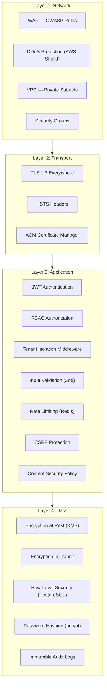

# Architecture Overview

> **IEKB Section:** 00 — Foundation & Overview  
> **Document:** 03-architecture-overview.md  
> **Last Updated:** 2026-07-16  
> **Owner:** Platform Team / Tech Lead  
> **Status:** Approved

---

## Table of Contents

1. [Architecture Philosophy](#architecture-philosophy)
2. [System Context Diagram](#system-context-diagram)
3. [High-Level Architecture](#high-level-architecture)
4. [Component Breakdown](#component-breakdown)
5. [Data Flow Architecture](#data-flow-architecture)
6. [Communication Patterns](#communication-patterns)
7. [Twelve-Factor App Compliance](#twelve-factor-app-compliance)
8. [Scalability Architecture](#scalability-architecture)
9. [Security Architecture](#security-architecture)
10. [Error Handling Architecture](#error-handling-architecture)
11. [Technology Stack Rationale](#technology-stack-rationale)
12. [Architecture Decision Records (ADRs)](#architecture-decision-records-adrs)
13. [Evolution Path (V0 → V1.1)](#evolution-path-v0--v11)
14. [Related Documents](#related-documents)

---

## Architecture Philosophy

InfraWatch V0 follows a **modular monolith** architecture — a single deployable application with clearly defined internal module boundaries. This approach balances:

- **Development velocity** — One codebase, one deployment, one debugging surface
- **Future extractability** — Clean module boundaries enable microservice extraction when scale demands it
- **Operational simplicity** — Fewer moving parts for a small team to manage

### Guiding Principles



---

## System Context Diagram

The system context shows InfraWatch's boundaries and external interactions:



---

## High-Level Architecture

### Container Diagram



---

## Component Breakdown

### API Server — Internal Modules

The API server is a modular monolith with the following internal structure:

```mermaid
flowchart LR
    subgraph API_SERVER["API Server"]
        subgraph MIDDLEWARE["Middleware Layer"]
            CORS["CORS"]
            RateLimit["Rate Limiter"]
            AuthMW["JWT Auth"]
            TenantMW["Tenant Context"]
            ValidMW["Request Validation"]
            LogMW["Request Logger"]
        end

        subgraph ROUTES["Route Layer"]
            AuthR["/auth/*"]
            OrgR["/orgs/*"]
            UserR["/orgs/:id/users/*"]
            AssetR["/orgs/:id/assets/*"]
            CameraR["/orgs/:id/cameras/*"]
            InspectionR["/orgs/:id/inspections/*"]
            IncidentR["/orgs/:id/incidents/*"]
            ReportR["/orgs/:id/reports/*"]
            DashR["/orgs/:id/dashboard/*"]
        end

        subgraph SERVICES["Service Layer"]
            AuthSvc["AuthService"]
            OrgSvc["OrgService"]
            UserSvc["UserService"]
            AssetSvc["AssetService"]
            CameraSvc["CameraService"]
            InspSvc["InspectionService"]
            IncSvc["IncidentService"]
            ReportSvc["ReportService"]
            NotifSvc["NotificationService"]
            FileSvc["FileUploadService"]
        end

        subgraph DATA_ACCESS["Data Access Layer"]
            Prisma["Prisma ORM Client"]
            S3Client["S3 Client"]
            RedisClient["Redis Client"]
            EmailClient["Email Client (SendGrid)"]
            SlackClient["Slack Client"]
        end
    end

    MIDDLEWARE --> ROUTES
    ROUTES --> SERVICES
    SERVICES --> DATA_ACCESS
```



### Module Dependency Rules

```
MIDDLEWARE → ROUTES → SERVICES → DATA ACCESS
     ↓
  (Each layer may only call the layer directly below it)
  (Services may call other services but must avoid circular dependencies)
  (Data access layer has NO business logic)
```

| Rule | Description |
|------|-------------|
| **No skip-layer calls** | Routes must not directly access Prisma; they call services |
| **No circular dependencies** | If ServiceA calls ServiceB, ServiceB must not call ServiceA |
| **Tenant scoping in services** | Every service method receives `tenantId` and scopes all queries |
| **No business logic in data access** | Prisma queries are simple CRUD; business rules live in services |
| **No HTTP concerns in services** | Services return data/errors; routes handle HTTP status codes |

### Module Descriptions

| Module | Responsibility | Key Dependencies |
|--------|---------------|-----------------|
| **AuthService** | Login, token generation/refresh, password hashing, token validation | Prisma (users), bcrypt, jsonwebtoken |
| **OrgService** | Organization CRUD, tenant provisioning, settings management | Prisma (organizations), AuthService |
| **UserService** | User CRUD, role assignment, profile management, invitation | Prisma (users), AuthService, NotificationService |
| **AssetService** | Asset CRUD, filtering, geo queries, metadata management, bulk operations | Prisma (assets, asset_types) |
| **CameraService** | Camera registration, RTSP validation, asset linking, status tracking | Prisma (cameras), AssetService |
| **InspectionService** | Inspection scheduling, completion, image association, overdue tracking | Prisma (inspections, inspection_images), FileUploadService |
| **IncidentService** | Incident lifecycle, status transitions, assignment, escalation | Prisma (incidents), NotificationService |
| **ReportService** | Report generation requests, template rendering, PDF/CSV creation | Prisma (inspections, incidents), BullMQ (enqueue), S3Client |
| **NotificationService** | Email/Slack notifications, template rendering, preference management | EmailClient, SlackClient, BullMQ (enqueue) |
| **FileUploadService** | Pre-signed URL generation, upload validation, image processing dispatch | S3Client, BullMQ (enqueue) |

---

## Data Flow Architecture

### Request Lifecycle



### Async Job Flow



---

## Communication Patterns

### Synchronous Communication

| Pattern | Used For | Protocol | Timeout |
|---------|----------|----------|---------|
| **REST API calls** | All client-server communication | HTTPS/JSON | 30s |
| **Database queries** | All data operations | PostgreSQL wire protocol | 10s |
| **Redis commands** | Cache, rate limiting, session | Redis protocol | 5s |
| **S3 operations** | Pre-signed URL generation | AWS SDK/HTTPS | 15s |

### Asynchronous Communication

| Pattern | Used For | Technology | Retry Policy |
|---------|----------|-----------|--------------|
| **Job queue** | Report generation, image processing | BullMQ (Redis) | 3 retries, exponential backoff |
| **Email dispatch** | Notifications, report delivery | BullMQ → SendGrid | 5 retries, 1min/5min/15min/30min/60min |
| **Slack webhooks** | Incident alerts | BullMQ → Slack API | 3 retries, exponential backoff |

### Future Communication (V1.1)

| Pattern | Used For | Technology |
|---------|----------|-----------|
| **Event streaming** | AI inference triggers | Redis Streams or AWS SQS |
| **WebSocket** | Real-time dashboard updates | Socket.io |
| **gRPC** | AI service inference calls | gRPC/protobuf |

---

## Twelve-Factor App Compliance

InfraWatch's architecture adheres to the [Twelve-Factor App](https://12factor.net) methodology:

| Factor | Implementation |
|--------|---------------|
| **I. Codebase** | Single Git repository (monorepo) tracked in GitHub. One codebase, many deploys (dev/staging/prod). |
| **II. Dependencies** | Explicitly declared in `package.json`. No system-level dependencies assumed. Docker containers bundle everything. |
| **III. Config** | All configuration via environment variables. No config files committed with secrets. `.env.example` documents required vars. |
| **IV. Backing Services** | PostgreSQL, Redis, S3, SendGrid treated as attached resources. Connection strings via env vars. Swappable without code changes. |
| **V. Build, Release, Run** | CI/CD pipeline builds Docker images (build), tags with git SHA (release), deploys to K8s (run). Immutable releases. |
| **VI. Processes** | API server and workers are stateless. No in-memory sessions. All state in PostgreSQL or Redis. Any instance can handle any request. |
| **VII. Port Binding** | API server self-contained with Express, binds to `PORT` env var. No external web server required (Nginx is for edge, not app server). |
| **VIII. Concurrency** | Scale out via process model: multiple API pods behind ALB, multiple worker pods consuming from shared queue. |
| **IX. Disposability** | Fast startup (< 5s), graceful shutdown (drain connections, complete in-progress jobs). Docker health checks for liveness. |
| **X. Dev/Prod Parity** | Docker Compose replicates production topology locally. Same PostgreSQL version, same Redis, same S3 (LocalStack or MinIO for dev). |
| **XI. Logs** | Structured JSON logs to stdout. No file-based logging. Log aggregation via ELK/CloudWatch. |
| **XII. Admin Processes** | Migrations, seeds, and one-off tasks run as standalone containers using the same codebase. `npx prisma migrate deploy`, `npx ts-node scripts/seed.ts`. |

---

## Scalability Architecture

### Horizontal Scaling Strategy



### Scaling Thresholds

| Component | Metric | Scale Up | Scale Down | Min | Max |
|-----------|--------|----------|------------|-----|-----|
| **API Pods** | CPU > 70% for 3 min | Add 1 pod | CPU < 30% for 10 min | 2 | 10 |
| **Worker Pods** | Queue depth > 100 | Add 1 pod | Queue depth < 10 for 5 min | 1 | 5 |
| **PostgreSQL** | Read latency > 100ms | Add read replica | Manual decision | 1 primary + 1 replica | 1 primary + 3 replicas |
| **Redis** | Memory > 80% | Upgrade instance | Manual decision | 1 node | 3 nodes (cluster) |

### Capacity Planning (V0 Estimates)

| Metric | Small (10 tenants) | Medium (100 tenants) | Large (500 tenants) |
|--------|-------------------|---------------------|---------------------|
| **API requests/day** | 10,000 | 100,000 | 500,000 |
| **Concurrent users** | 50 | 500 | 2,500 |
| **DB size (1 year)** | 5 GB | 50 GB | 250 GB |
| **S3 storage (1 year)** | 50 GB | 500 GB | 2.5 TB |
| **API pods needed** | 2 | 3–5 | 5–10 |
| **Worker pods needed** | 1 | 2–3 | 3–5 |

---

## Security Architecture

### Defense-in-Depth Layers



### Trust Boundaries

| Boundary | Description | Controls |
|----------|-------------|----------|
| **Internet → Edge** | Public traffic enters through ALB | WAF rules, DDoS protection, TLS termination |
| **Edge → Application** | ALB forwards to API pods | Private subnet, security groups, health checks |
| **Application → Data** | API pods access databases | Network policies, connection pooling, parameterized queries |
| **Tenant → Tenant** | Data isolation between organizations | JWT tenant claims, middleware enforcement, RLS policies, query scoping |
| **API → Workers** | Job dispatching via Redis | Serialized job data, no direct DB credentials sharing |
| **Application → External** | Outbound to SendGrid, Slack, S3 | IAM roles, API keys in secrets manager, egress rules |

---

## Error Handling Architecture

### Error Classification

| Category | HTTP Status | Example | Handling |
|----------|------------|---------|----------|
| **Client Error — Validation** | 400 | Invalid email format | Return field-level errors |
| **Client Error — Auth** | 401 | Expired JWT | Return "Unauthorized" |
| **Client Error — Forbidden** | 403 | Inspector accessing admin endpoint | Return "Forbidden" |
| **Client Error — Not Found** | 404 | Asset with ID doesn't exist | Return "Not Found" |
| **Client Error — Conflict** | 409 | Duplicate email registration | Return conflict details |
| **Server Error — Internal** | 500 | Unhandled exception | Log full stack trace, return generic error |
| **Server Error — Service Unavailable** | 503 | Database connection failure | Trigger circuit breaker, retry |

### Standardized Error Response

```json
{
  "error": {
    "code": "VALIDATION_ERROR",
    "message": "Request validation failed",
    "details": [
      {
        "field": "email",
        "message": "Must be a valid email address",
        "code": "INVALID_FORMAT"
      }
    ],
    "requestId": "req_abc123def456",
    "timestamp": "2026-07-16T10:30:00.000Z"
  }
}
```

---

## Technology Stack Rationale

### Why Each Technology

| Technology | Choice | Primary Alternative | Why We Chose It |
|-----------|--------|--------------------|-|
| **TypeScript** | Primary language | JavaScript, Python | Type safety catches bugs at compile time; shared language for frontend and backend |
| **React 18** | Frontend framework | Vue, Angular, Svelte | Largest ecosystem, best hiring pool, excellent TypeScript support |
| **Vite** | Build tool | Webpack, Parcel | 10-100x faster HMR, modern ESM-native, simpler config |
| **Express** | HTTP framework | Fastify, NestJS, Koa | Most mature, largest middleware ecosystem, team familiarity |
| **Prisma** | ORM | TypeORM, Knex, Drizzle | Best TypeScript integration, auto-generated types, visual DB browser |
| **PostgreSQL 16** | Database | MySQL, CockroachDB | Best JSONB support, RLS for tenant isolation, PostGIS for geo |
| **Redis 7** | Cache + Queue | Memcached, RabbitMQ | Dual-purpose (cache + BullMQ queue), simple operations |
| **BullMQ** | Job queue | Agenda, Bee-Queue, RabbitMQ | Redis-backed, TypeScript-native, excellent retry/DLQ support |
| **Zod** | Validation | Joi, Yup, class-validator | TypeScript-first, infers types from schemas, works at runtime |
| **Zustand** | State management | Redux, MobX, Jotai | Minimal boilerplate, TypeScript-native, no providers needed |
| **React Query (TanStack)** | Server state | SWR, RTK Query | Best cache invalidation, mutation hooks, devtools |
| **Terraform** | IaC | Pulumi, CloudFormation, CDK | Multi-cloud, mature HCL language, large community |
| **GitHub Actions** | CI/CD | Jenkins, GitLab CI, CircleCI | Tight GitHub integration, marketplace actions, free for open source |

---

## Architecture Decision Records (ADRs)

### ADR-001: Modular Monolith Over Microservices

| Field | Value |
|-------|-------|
| **Status** | Accepted |
| **Date** | 2026-07-16 |
| **Context** | Small team (4-6 engineers), V0 MVP with 2-month timeline. Need to move fast. |
| **Decision** | Build as a modular monolith with clean internal boundaries. Extract to microservices only when scaling or team size demands it. |
| **Consequences** | (+) Faster development, simpler debugging, one deployment. (-) Must maintain module discipline to avoid spaghetti. AI service (V1.1) will be a separate microservice from day one due to different runtime requirements (GPU, Python). |

### ADR-002: Logical Multi-Tenancy (Shared DB)

| Field | Value |
|-------|-------|
| **Status** | Accepted |
| **Date** | 2026-07-16 |
| **Context** | Need to support 50-500+ tenants cost-effectively. Separate DBs per tenant are operationally expensive. |
| **Decision** | Single PostgreSQL database with `tenant_id` on every table. PostgreSQL Row-Level Security (RLS) as defense-in-depth. |
| **Consequences** | (+) Lower cost, simpler operations, easier migrations. (-) Must rigorously enforce tenant scoping in application code and tests. Cross-tenant data leaks are a critical security risk. |

### ADR-003: JWT Over Session-Based Auth

| Field | Value |
|-------|-------|
| **Status** | Accepted |
| **Date** | 2026-07-16 |
| **Context** | Stateless API design, multiple client types (web, mobile), future microservice architecture. |
| **Decision** | Use JWT access tokens (15min) + refresh tokens (7 days). Access tokens in memory, refresh tokens in httpOnly cookies. |
| **Consequences** | (+) Stateless API, no session storage, works with any client. (-) Cannot revoke access tokens instantly (must wait for expiry). Implement token blacklist in Redis for critical revocations (e.g., password change). |

### ADR-004: BullMQ Over SQS/RabbitMQ

| Field | Value |
|-------|-------|
| **Status** | Accepted |
| **Date** | 2026-07-16 |
| **Context** | Need async job processing for reports, notifications, image processing. Already using Redis for caching. |
| **Decision** | Use BullMQ backed by Redis for all async job processing. |
| **Consequences** | (+) No additional infrastructure (reuses Redis), TypeScript-native, excellent retry and DLQ support, rate limiting built-in. (-) Coupled to Redis; if we scale beyond Redis capacity, may need to migrate to SQS/RabbitMQ. Acceptable for V0 scale. |

### ADR-005: Prisma Over Raw SQL / Knex

| Field | Value |
|-------|-------|
| **Status** | Accepted |
| **Date** | 2026-07-16 |
| **Context** | Need type-safe database access, migration management, and developer productivity. |
| **Decision** | Use Prisma as the primary ORM with raw SQL escape hatch for complex queries (e.g., geo, analytics). |
| **Consequences** | (+) Auto-generated TypeScript types, Prisma Studio for debugging, declarative schema, managed migrations. (-) Generated SQL may not be optimal for complex joins; use `$queryRaw` for performance-critical queries. Prisma Client adds ~5MB to bundle. |

---

## Evolution Path (V0 → V1.1)

### V0 Architecture (Current)

```
┌─────────────────────────────────────────┐
│              Modular Monolith            │
│  ┌──────┐ ┌──────┐ ┌──────┐ ┌──────┐   │
│  │ Auth │ │Assets│ │Insp. │ │Report│   │
│  └──────┘ └──────┘ └──────┘ └──────┘   │
│              ↕ Prisma ORM                │
│         ┌──────────────┐                 │
│         │  PostgreSQL  │                 │
│         └──────────────┘                 │
└─────────────────────────────────────────┘
```

### V1.1 Architecture (Planned)

```
┌─────────────────────────────────────────┐
│          InfraWatch Core (Monolith)      │
│  ┌──────┐ ┌──────┐ ┌──────┐ ┌──────┐   │
│  │ Auth │ │Assets│ │Insp. │ │Report│   │
│  └──────┘ └──────┘ └──────┘ └──────┘   │
└────────────────┬────────────────────────┘
                 │ REST / Events
┌────────────────┴────────────────────────┐
│           AI Service (Python/FastAPI)    │
│  ┌──────────┐ ┌──────────┐ ┌─────────┐ │
│  │ Object   │ │ PPE      │ │Anomaly  │ │
│  │Detection │ │Compliance│ │Detection│ │
│  └──────────┘ └──────────┘ └─────────┘ │
│              ↕ S3 + Redis Streams        │
│         ┌──────────────┐                 │
│         │ Model Store  │                 │
│         └──────────────┘                 │
└─────────────────────────────────────────┘
```

### Key V1.1 Architectural Changes

| Change | V0 State | V1.1 State | Migration Path |
|--------|----------|------------|---------------|
| **AI Service** | Does not exist | Separate Python/FastAPI microservice with GPU | New deployment; communicates via REST + Redis Streams |
| **Event Bus** | BullMQ only | BullMQ + Redis Streams | Add Redis Streams consumer; BullMQ stays for existing jobs |
| **Model Store** | Does not exist | S3 bucket + DynamoDB metadata | New Terraform module |
| **WebSocket** | Not used | Socket.io for real-time alerts | Add Socket.io server to API; new frontend connection |
| **Database** | Current schema | Add `predictions`, `model_versions`, `ai_reviews` tables | New Prisma migrations |

---

## Related Documents

- **Previous:** [Glossary](./02-glossary.md)
- **Next:** [Technology Stack Decisions](./04-tech-stack-decisions.md)
- **Deep Dive:** [Backend Overview](../03-backend/00-backend-overview.md) — Internal module architecture
- **Security:** [Security Overview](../10-security/00-security-overview.md) — Detailed security architecture
- **Multi-Tenancy:** [Tenancy Overview](../11-multi-tenancy/00-tenancy-overview.md) — Tenant isolation patterns
- **Deployment:** [Docker Setup](../08-devops/01-docker-setup.md) — Container architecture
- **Index:** [IEKB Master Index](./00-IEKB-index.md)

