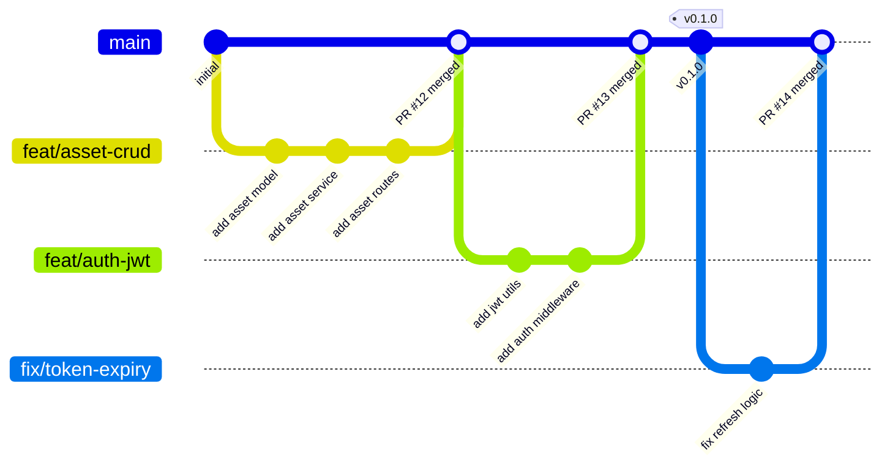
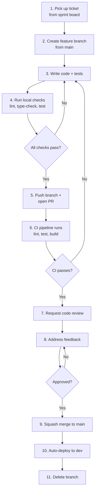
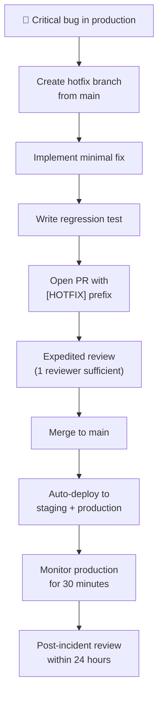
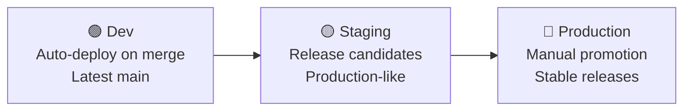

# Development Workflow

> **IEKB Section:** 00 — Foundation & Overview  
> **Document:** 07-development-workflow.md  
> **Last Updated:** 2026-07-16  
> **Owner:** Tech Lead  
> **Status:** Approved

---

## Table of Contents

1. [Overview](#overview)
2. [Git Branching Strategy](#git-branching-strategy)
3. [Branch Naming Conventions](#branch-naming-conventions)
4. [Development Flow](#development-flow)
5. [Pull Request Process](#pull-request-process)
6. [Code Review Guidelines](#code-review-guidelines)
7. [Merge Strategy](#merge-strategy)
8. [Release Process](#release-process)
9. [Hotfix Process](#hotfix-process)
10. [Environment Promotion](#environment-promotion)
11. [Feature Flags](#feature-flags)
12. [Related Documents](#related-documents)

---

## Overview

InfraWatch follows a **trunk-based development** workflow with short-lived feature branches. The `main` branch is always deployable, and all changes go through pull requests with mandatory code review.



---

## Git Branching Strategy

### Branch Types

| Branch | Purpose | Lifetime | Base Branch | Merges Into |
|--------|---------|----------|------------|-------------|
| `main` | Production-ready code | Permanent | — | — |
| `feat/{description}` | New feature development | 1-3 days | `main` | `main` |
| `fix/{description}` | Bug fix | < 1 day | `main` | `main` |
| `hotfix/{description}` | Critical production fix | < 4 hours | `main` | `main` |
| `chore/{description}` | Maintenance, deps, docs | < 1 day | `main` | `main` |
| `refactor/{description}` | Code restructuring | 1-2 days | `main` | `main` |
| `release/{version}` | Release preparation | < 1 day | `main` | `main` (tag) |

### Rules

1. **`main` is always deployable** — All CI checks must pass before merge
2. **No direct commits to `main`** — Everything goes through PRs
3. **Short-lived branches** — Feature branches should live < 3 days
4. **Rebase before merge** — Keep a clean, linear history
5. **Delete branches after merge** — No stale branches

---

## Branch Naming Conventions

```
{type}/{ticket-number}-{short-description}
```

**Examples:**

```bash
feat/IW-42-asset-crud-api
fix/IW-57-token-expiry-handling
chore/IW-63-upgrade-prisma
refactor/IW-71-extract-notification-service
hotfix/IW-99-fix-tenant-data-leak
docs/IW-80-update-api-spec
```

**Rules:**
- Use lowercase letters, numbers, and hyphens only
- Include ticket number when available
- Keep descriptions short (3-5 words)
- No special characters or spaces

---

## Development Flow

### Daily Workflow



### Step-by-Step Commands

```bash
# 1. Start from latest main
git checkout main
git pull origin main

# 2. Create feature branch
git checkout -b feat/IW-42-asset-crud-api

# 3. Develop (with frequent commits)
git add .
git commit -m "feat(assets): add asset model and schema"

git add .
git commit -m "feat(assets): add asset service with CRUD operations"

git add .
git commit -m "test(assets): add unit tests for asset service"

# 4. Run local checks
npm run lint
npm run type-check
npm run test

# 5. Push and open PR
git push -u origin feat/IW-42-asset-crud-api
# → Open PR on GitHub

# 6-8. CI runs, review happens, iterate

# 9. After approval, merge via GitHub UI (squash merge)

# 10. Clean up
git checkout main
git pull origin main
git branch -d feat/IW-42-asset-crud-api
```

### Pre-commit Hooks (Husky)

```json
// package.json
{
  "lint-staged": {
    "*.{ts,tsx}": ["eslint --fix", "prettier --write"],
    "*.{json,md,css}": ["prettier --write"]
  }
}
```

```bash
# .husky/pre-commit
npx lint-staged

# .husky/pre-push
npm run type-check
npm run test -- --run
```

---

## Pull Request Process

### PR Template

```markdown
## Description
Brief description of the change and its purpose.

## Type of Change
- [ ] 🚀 New feature
- [ ] 🐛 Bug fix
- [ ] ♻️ Refactor
- [ ] 📚 Documentation
- [ ] 🔧 Maintenance

## Related Tickets
- IW-42

## Changes Made
- Added `AssetService` with CRUD operations
- Added Zod validation schemas for asset creation/update
- Added integration tests for all asset endpoints

## Testing
- [ ] Unit tests added/updated
- [ ] Integration tests added/updated
- [ ] Manual testing performed
- [ ] All existing tests pass

## Checklist
- [ ] Code follows InfraWatch coding standards
- [ ] All queries scoped by `tenant_id`
- [ ] No `any` types introduced
- [ ] Error handling follows standard patterns
- [ ] API changes reflected in OpenAPI spec
- [ ] No secrets or credentials in code
- [ ] Documentation updated (if applicable)

## Screenshots/Recordings
(If UI changes, attach screenshots or recordings)
```

### PR Size Guidelines

| PR Size | Lines Changed | Target |
|---------|--------------|--------|
| **Small (ideal)** | < 200 lines | 70% of PRs |
| **Medium** | 200-500 lines | 25% of PRs |
| **Large** | 500-1000 lines | 5% of PRs (needs justification) |
| **Too Large** | > 1000 lines | 0% — must be broken up |

> [!TIP]
> If a feature requires > 500 lines, break it into multiple PRs:
> 1. Database migration + model
> 2. Service layer + tests
> 3. API routes + integration tests
> 4. Frontend components

---

## Code Review Guidelines

### Reviewer Responsibilities

1. **Respond within 4 business hours** of being requested
2. **Focus on correctness, security, and maintainability** — not style (that's what linters are for)
3. **Ask questions** instead of making demands — "What do you think about...?" > "Change this to..."
4. **Approve when good enough** — Don't block for minor preferences

### Review Checklist

#### Security
- [ ] All database queries scoped by `tenant_id`
- [ ] RBAC middleware applied to new endpoints
- [ ] Input validated with Zod schemas
- [ ] No SQL injection, XSS, or CSRF vectors
- [ ] No hardcoded secrets

#### Correctness
- [ ] Business logic matches acceptance criteria
- [ ] Edge cases handled (null, empty, max values)
- [ ] Error responses follow standard format
- [ ] Async operations properly awaited

#### Quality
- [ ] Tests cover happy path and error cases
- [ ] No N+1 database queries
- [ ] Functions are small and focused
- [ ] Types are precise (no `any`)

#### Architecture
- [ ] Changes follow layer boundaries (routes → controllers → services → data)
- [ ] No circular dependencies between modules
- [ ] Shared code placed in `packages/shared`

### Review Comment Prefixes

| Prefix | Meaning | Blocking? |
|--------|---------|-----------|
| `[BLOCKER]` | Must be fixed before merge | Yes |
| `[SUGGESTION]` | Improvement, but not required | No |
| `[QUESTION]` | Need clarification | Depends |
| `[NIT]` | Minor style/preference | No |
| `[PRAISE]` | Great work! | No |

---

## Merge Strategy

### Squash Merge (Default)

All PRs use **squash merge** to keep `main` history clean:

```bash
# What happens on merge:
# All commits in the branch are squashed into ONE commit on main
# The commit message uses the PR title as the commit message
# Example final commit: "feat(assets): add asset CRUD API (#42)"
```

### Commit Message for Merge

```
{type}({scope}): {PR title} (#{PR number})

{PR description body — auto-populated from PR}

Co-authored-by: Reviewer Name <reviewer@example.com>
```

### When NOT to Squash

Use **merge commit** (not squash) only for:
- Release branches with multiple meaningful commits
- Large refactors where individual commits provide useful history

---

## Release Process

### Versioning: Semantic Versioning (SemVer)

```
MAJOR.MINOR.PATCH
  │     │     └── Bug fixes, patches
  │     └──────── New features (backward-compatible)
  └────────────── Breaking changes
```

**V0 Versioning:**
- `0.1.0` — Sprint 1 complete (Auth + Org)
- `0.2.0` — Sprint 2 complete (Assets + Cameras)
- `0.3.0` — Sprint 3 complete (Inspections + Incidents)
- `0.4.0` — Sprint 4 complete (Reports + Dashboard)
- `1.0.0` — V0 MVP Launch

### Release Checklist

```markdown
## Release v{version}

### Pre-Release
- [ ] All sprint tickets completed
- [ ] All tests passing on `main`
- [ ] No P0/P1 bugs open
- [ ] OpenAPI spec updated
- [ ] Database migrations reviewed
- [ ] Performance benchmarks acceptable
- [ ] Security scan clean

### Release Steps
1. [ ] Create release branch: `git checkout -b release/v{version}`
2. [ ] Update version in `package.json` files
3. [ ] Update CHANGELOG.md
4. [ ] Run full test suite
5. [ ] Create PR: `release/v{version}` → `main`
6. [ ] Get release approval
7. [ ] Merge and tag: `git tag v{version}`
8. [ ] CI/CD deploys to staging automatically
9. [ ] Run smoke tests on staging
10. [ ] Promote to production

### Post-Release
- [ ] Verify production health
- [ ] Monitor error rates for 1 hour
- [ ] Update release notes on GitHub
- [ ] Notify stakeholders
- [ ] Close sprint in project tracker
```

---

## Hotfix Process



### Hotfix Rules

1. **Scope:** Fix only the critical bug — no feature work, no refactoring
2. **Review:** Expedited — 1 senior reviewer sufficient (normally 2 required)
3. **Testing:** Must include regression test that reproduces the bug
4. **Deploy:** Goes straight to production after staging verification
5. **Postmortem:** Required within 24 hours

---

## Environment Promotion



| Environment | Deployment Trigger | Data | Purpose |
|------------|-------------------|------|---------|
| **Dev** | Auto on merge to `main` | Seed data, ephemeral | Feature testing, integration |
| **Staging** | Auto on tag/release | Anonymized production copy | QA, UAT, performance testing |
| **Production** | Manual approval | Real customer data | Live system |

---

## Feature Flags

### When to Use Feature Flags

- **Gradual rollout** — Enable for beta tenants first
- **Kill switch** — Disable a feature instantly without deployment
- **A/B testing** — Test variations (V1.1)
- **Incomplete features** — Merge code to main before the feature is complete

### Implementation

```typescript
// Feature flag configuration
const FEATURE_FLAGS = {
  ENABLE_MAP_VIEW: process.env.FF_ENABLE_MAP_VIEW === 'true',
  ENABLE_SLACK_NOTIFICATIONS: process.env.FF_ENABLE_SLACK === 'true',
  ENABLE_CSV_EXPORT: process.env.FF_ENABLE_CSV === 'true',
} as const;

// Usage in route
if (FEATURE_FLAGS.ENABLE_MAP_VIEW) {
  router.get('/map-data', controller.getMapData);
}

// Usage in frontend
{FEATURE_FLAGS.ENABLE_MAP_VIEW && <AssetMap assets={assets} />}
```

---

## Related Documents

- **Previous:** [Repository Structure](./06-repository-structure.md)
- **CI/CD:** [CI/CD Pipeline](../08-devops/06-ci-cd-pipeline.md) — Automated pipeline details
- **Coding Standards:** [Coding Standards](./05-coding-standards.md) — What to check in code review
- **Testing:** [Testing Strategy](../07-testing/00-testing-strategy.md) — What tests are required
- **Index:** [IEKB Master Index](./00-IEKB-index.md)
