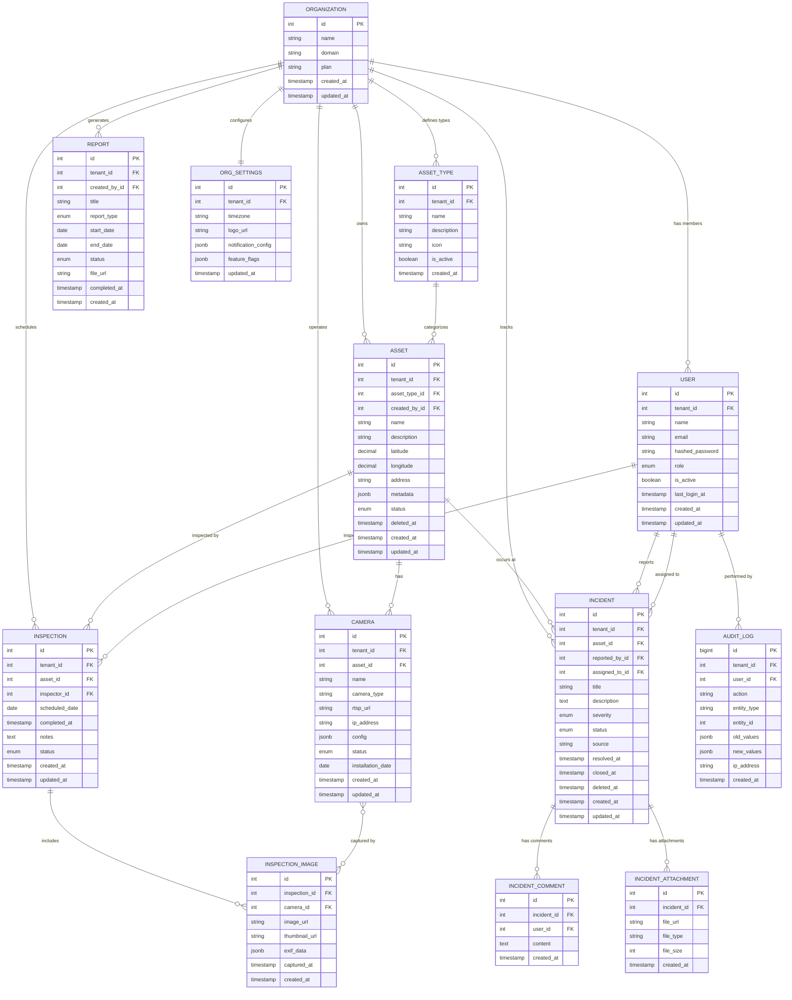
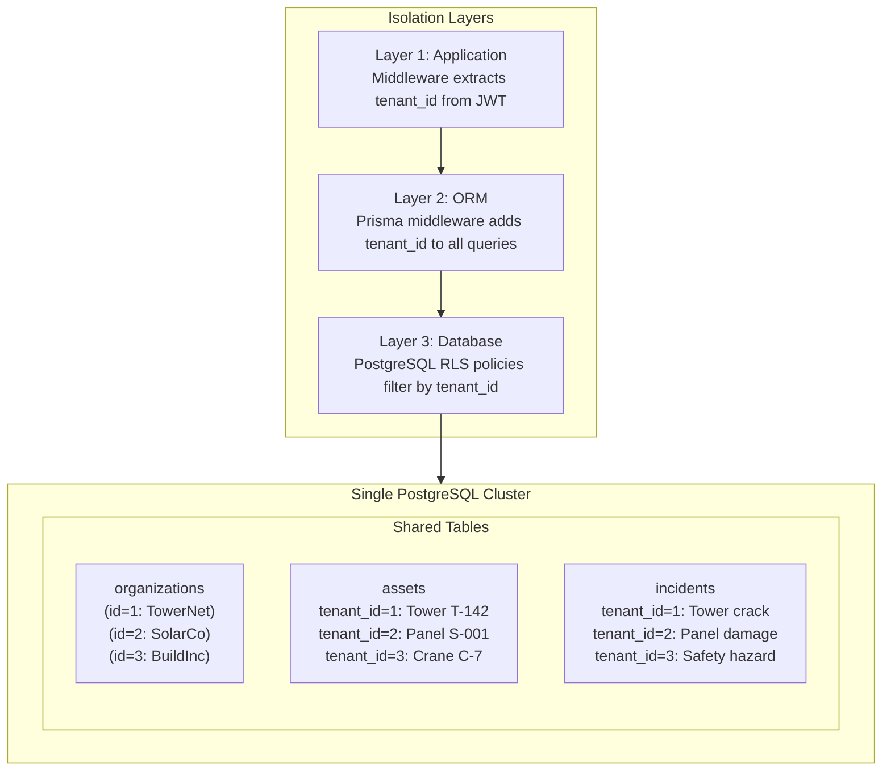
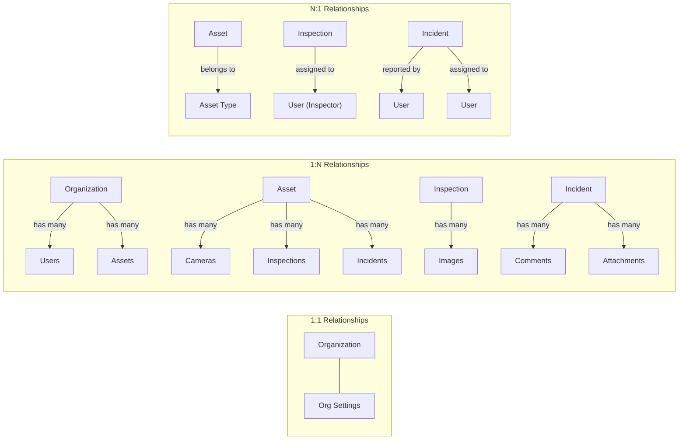
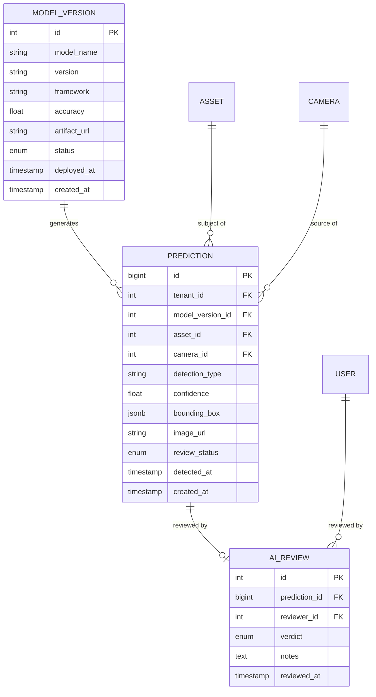

# Data Model Overview

> **IEKB Section:** 01 — Database  
> **Document:** 00-data-model-overview.md  
> **Last Updated:** 2026-07-16  
> **Owner:** Tech Lead / Database Engineer  
> **Status:** Approved

---

## Table of Contents

1. [Design Philosophy](#design-philosophy)
2. [Entity-Relationship Diagram](#entity-relationship-diagram)
3. [Entity Summary](#entity-summary)
4. [Multi-Tenancy Strategy](#multi-tenancy-strategy)
5. [Normalization Decisions](#normalization-decisions)
6. [Data Types & Conventions](#data-types--conventions)
7. [Relationship Map](#relationship-map)
8. [Schema Evolution Strategy](#schema-evolution-strategy)
9. [V1.1 Schema Extensions](#v11-schema-extensions)
10. [Related Documents](#related-documents)

---

## Design Philosophy

InfraWatch's data model follows these principles:

1. **Tenant-First Design** — Every table includes `tenant_id` as the first column after `id`. Every query is scoped by tenant.
2. **Normalized Core, Flexible Edges** — Core entities are fully normalized (3NF). Extensibility is provided via JSONB `metadata` columns.
3. **Audit by Default** — Every table includes `created_at` and `updated_at` timestamps. Critical entities include `created_by_id`.
4. **Referential Integrity** — All relationships are enforced with foreign keys. Cascading deletes are used sparingly and documented.
5. **Soft Deletes for Critical Data** — Assets and incidents use soft deletes (`deleted_at`) to preserve audit trails.
6. **UTC Timestamps** — All timestamps are stored in UTC. Timezone conversion happens in the presentation layer.

---

## Entity-Relationship Diagram

### Complete ER Diagram (V0)



---

## Entity Summary

| Entity | Description | Estimated Rows (Year 1) | Tenant-Scoped | Soft Delete |
|--------|------------|------------------------|---------------|-------------|
| **Organization** | Tenant/company | 50-500 | No (is the tenant) | No |
| **User** | Application users | 500-5,000 | Yes | No (deactivate) |
| **Asset Type** | Configurable asset categories | 500-2,500 | Yes | No (deactivate) |
| **Asset** | Physical infrastructure items | 5,000-50,000 | Yes | Yes |
| **Camera** | CCTV/IoT devices | 2,000-20,000 | Yes | No (deactivate) |
| **Inspection** | Scheduled/completed surveys | 20,000-200,000 | Yes | No |
| **Inspection Image** | Photos from inspections | 50,000-500,000 | Via inspection | No |
| **Incident** | Reported problems/hazards | 10,000-100,000 | Yes | Yes |
| **Incident Comment** | Comments on incidents | 30,000-300,000 | Via incident | No |
| **Incident Attachment** | Files attached to incidents | 15,000-150,000 | Via incident | No |
| **Report** | Generated PDF/CSV reports | 5,000-50,000 | Yes | No |
| **Org Settings** | Per-tenant configuration | 50-500 | Yes (1:1) | No |
| **Audit Log** | Immutable action log | 500,000-5,000,000 | Yes | No (append-only) |

---

## Multi-Tenancy Strategy

### Approach: Shared Database with Row-Level Isolation



### Isolation Implementation

1. **Application Layer** — JWT contains `tenantId`; middleware extracts and attaches to request context
2. **Service Layer** — Every service method accepts `tenantId` as first parameter; all Prisma queries include `where: { tenantId }`
3. **ORM Layer** — Prisma middleware automatically appends `tenantId` to queries as defense-in-depth
4. **Database Layer** — PostgreSQL Row-Level Security (RLS) policies as the final safety net

See [Data Isolation](../11-multi-tenancy/01-data-isolation.md) for complete implementation details.

### Tenant ID Propagation

```
JWT Token → Auth Middleware → Tenant Middleware → Controller → Service → Prisma → PostgreSQL
     ↓            ↓                ↓                ↓           ↓         ↓          ↓
  Contains    Validates       Extracts &        Receives    Passes    Includes    RLS
  tenantId    JWT token       attaches to       tenantId    to ORM    in WHERE    enforces
              claims          req.tenantContext                       clause      policy
```

---

## Normalization Decisions

### Third Normal Form (3NF) Core

| Decision | Rationale |
|----------|----------|
| **Asset Types as separate table** | Configurable per tenant; avoids string inconsistency ("Tower" vs "tower" vs "TOWER") |
| **Users separate from Organizations** | Many-to-one relationship; users reference their org via `tenant_id` |
| **Inspection Images as separate table** | One-to-many from Inspection; each image has its own metadata |
| **Incident Comments as separate table** | Unbounded one-to-many; keeps incident table clean |
| **Org Settings as separate table** | 1:1 with Organization; keeps the org table small and fast |

### Deliberate Denormalization

| Decision | Rationale |
|----------|----------|
| **`tenant_id` on child tables** | Redundant with parent's `tenant_id`, but enables direct tenant-scoped queries without joins. Critical for performance and RLS policies. |
| **Asset `address` field** | Denormalized from geocoding. Stored alongside lat/lng to avoid reverse-geocoding on every read. |
| **Report `title`** | Generated from date range at creation time. Stored to avoid recalculation. |

### JSONB Fields (Extensibility)

| Table | Column | Purpose | Indexed? |
|-------|--------|---------|----------|
| `assets` | `metadata` | Custom key-value fields per tenant (e.g., "height", "capacity") | GIN index |
| `cameras` | `config` | Camera-specific configuration (FoV, resolution, recording schedule) | No |
| `org_settings` | `notification_config` | Per-tenant notification preferences | No |
| `org_settings` | `feature_flags` | Per-tenant feature flag overrides | No |
| `audit_logs` | `old_values` / `new_values` | Capture of changed fields for audit | No |
| `inspection_images` | `exif_data` | EXIF metadata extracted from photos | No |

---

## Data Types & Conventions

### Column Type Standards

| Data Type | PostgreSQL Type | Usage |
|-----------|----------------|-------|
| **Primary Key** | `SERIAL` (int4) or `BIGSERIAL` (int8) | `id` column on every table. Use `BIGSERIAL` for high-volume tables (audit_logs). |
| **Foreign Key** | `INTEGER` or `BIGINT` | Matches referenced table's PK type. Always `NOT NULL` for required relationships. |
| **String (short)** | `VARCHAR(n)` | Bounded strings: names (255), emails (320), titles (500) |
| **String (long)** | `TEXT` | Unbounded text: descriptions, notes, comments |
| **Enum** | `VARCHAR(50)` + `CHECK` constraint | Status fields, roles. Not PostgreSQL ENUM (hard to alter). |
| **Boolean** | `BOOLEAN` | Flags: `is_active`, `is_verified` |
| **Timestamp** | `TIMESTAMPTZ` | All dates/times. Always with timezone (stored as UTC). |
| **Date** | `DATE` | Date-only fields: `scheduled_date`, `installation_date` |
| **Decimal** | `DECIMAL(10, 7)` | Geo-coordinates (lat/lng). 7 decimal places = ~1cm precision. |
| **JSON** | `JSONB` | Flexible metadata, configuration. Binary JSON with indexing support. |
| **Money** | `DECIMAL(12, 2)` | Currency values (future: billing). Never use `MONEY` type. |
| **File size** | `BIGINT` | Bytes. Allows files up to 9.2 exabytes. |
| **IP Address** | `INET` | Client IP for audit logs. PostgreSQL native IP type. |

### Naming Conventions

| Element | Convention | Example |
|---------|-----------|---------|
| Tables | `snake_case`, plural | `assets`, `inspection_images`, `audit_logs` |
| Columns | `snake_case` | `tenant_id`, `created_at`, `asset_type_id` |
| Primary Key | Always `id` | `id SERIAL PRIMARY KEY` |
| Foreign Key | `{referenced_singular}_id` | `tenant_id`, `asset_id`, `inspector_id` |
| Timestamps | `{event}_at` | `created_at`, `updated_at`, `deleted_at`, `resolved_at` |
| Booleans | `is_{adjective}` | `is_active`, `is_verified`, `is_deleted` |
| Indexes | `idx_{table}_{columns}` | `idx_assets_tenant_id_status` |
| Unique | `uq_{table}_{columns}` | `uq_users_tenant_id_email` |
| Check | `ck_{table}_{description}` | `ck_incidents_valid_status` |

---

## Relationship Map

### Relationship Types



### Cascade Rules

| Parent | Child | On Delete | Rationale |
|--------|-------|-----------|-----------|
| Organization | User | RESTRICT | Cannot delete org with users |
| Organization | Asset | RESTRICT | Cannot delete org with assets |
| Asset | Camera | SET NULL | Cameras can exist unlinked |
| Asset | Inspection | RESTRICT | Preserve inspection history |
| Asset | Incident | RESTRICT | Preserve incident history |
| Inspection | Inspection Image | CASCADE | Images meaningless without inspection |
| Incident | Incident Comment | CASCADE | Comments meaningless without incident |
| Incident | Incident Attachment | CASCADE | Attachments meaningless without incident |
| User | Inspection | RESTRICT | Cannot delete user with inspections |
| User | Incident | RESTRICT | Cannot delete user with incidents |

---

## Schema Evolution Strategy

### Migration Rules

1. **Every change is a migration** — No manual DDL in production
2. **Migrations are forward-only** — Rollback is a new migration that undoes the change
3. **Migrations must be backward-compatible** — Add columns with defaults, not remove columns
4. **Column removal is a two-step process:**
   - Migration 1: Stop writing to the column (code change)
   - Migration 2: Drop the column (after all code deployed)
5. **Index creation uses `CONCURRENTLY`** — No table locks in production

See [Migration Strategy](./01-migration-strategy.md) for complete procedures.

---

## V1.1 Schema Extensions

### Planned Tables for AI Integration



These tables are **not created in V0** but the schema is designed to accommodate them without breaking changes.

---

## Related Documents

- **Next:** [Migration Strategy](./01-migration-strategy.md) — How to manage schema changes
- **Baseline:** [Migration V001](./02-migration-V001-baseline.md) — Complete initial schema SQL
- **Entity Details:**
  - [Organization Table](./03-organization-table.md)
  - [User Table](./04-user-table.md)
  - [Asset Type Table](./05-asset-type-table.md)
  - [Asset Table](./06-asset-table.md)
  - [Camera Table](./07-camera-table.md)
  - [Inspection Tables](./08-inspection-tables.md)
  - [Incident Table](./09-incident-table.md)
- **Performance:** [Indexing & Performance](./10-indexing-performance.md)
- **Multi-Tenancy:** [Data Isolation](../11-multi-tenancy/01-data-isolation.md)
- **Index:** [IEKB Master Index](../00-foundation/00-IEKB-index.md)

