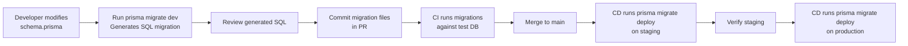
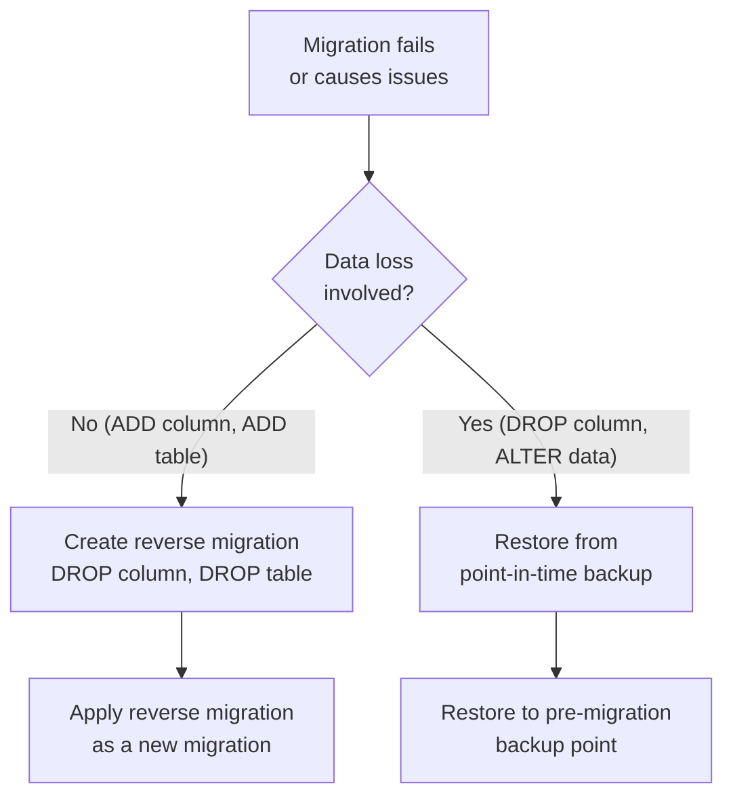

# Migration Strategy

> **IEKB Section:** 01 — Database  
> **Document:** 01-migration-strategy.md  
> **Last Updated:** 2026-07-16  
> **Owner:** Tech Lead / Database Engineer  
> **Status:** Approved

---

## Table of Contents

1. [Overview](#overview)
2. [Migration Tooling](#migration-tooling)
3. [Migration Lifecycle](#migration-lifecycle)
4. [Migration File Structure](#migration-file-structure)
5. [Creating Migrations](#creating-migrations)
6. [Running Migrations](#running-migrations)
7. [Rollback Procedures](#rollback-procedures)
8. [Safe Migration Patterns](#safe-migration-patterns)
9. [Dangerous Operations](#dangerous-operations)
10. [Multi-Tenant Migration Considerations](#multi-tenant-migration-considerations)
11. [Migration Testing](#migration-testing)
12. [Production Migration Checklist](#production-migration-checklist)
13. [Related Documents](#related-documents)

---

## Overview

InfraWatch uses **Prisma Migrate** for managing database schema changes. Every schema change is:

1. **Version-controlled** — Migration files live in `apps/api/prisma/migrations/`
2. **Sequentially applied** — Migrations run in chronological order, tracked in `_prisma_migrations` table
3. **Reviewed before deploy** — Migration SQL is reviewed in PRs like any other code
4. **Tested before production** — Migrations run on dev and staging before production

### Migration Flow



---

## Migration Tooling

### Prisma Migrate Commands

| Command | Purpose | Environment |
|---------|---------|-------------|
| `npx prisma migrate dev` | Create + apply migration in development | Local dev |
| `npx prisma migrate dev --name init` | Create named migration | Local dev |
| `npx prisma migrate deploy` | Apply pending migrations | Staging, Production |
| `npx prisma migrate status` | Check migration status | Any |
| `npx prisma migrate reset` | Drop DB + re-apply all migrations + seed | Local dev only |
| `npx prisma db push` | Push schema without creating migration | Prototyping only |
| `npx prisma generate` | Regenerate Prisma Client types | After schema changes |

> [!CAUTION]
> **Never use `prisma migrate reset` or `prisma db push` in staging or production.** These commands destroy data. They are development-only tools.

### Migration Tracking

Prisma tracks applied migrations in the `_prisma_migrations` table:

```sql
SELECT id, migration_name, started_at, finished_at, applied_steps_count
FROM _prisma_migrations
ORDER BY started_at DESC
LIMIT 10;
```

---

## Migration Lifecycle

### Development

```bash
# 1. Modify prisma/schema.prisma
# (Add new model, add field, change constraint, etc.)

# 2. Generate migration
npx prisma migrate dev --name add_incident_severity

# This will:
# - Generate SQL in prisma/migrations/20260716120000_add_incident_severity/migration.sql
# - Apply the migration to your local database
# - Regenerate Prisma Client

# 3. Review the generated SQL
cat prisma/migrations/20260716120000_add_incident_severity/migration.sql

# 4. If the SQL needs modification (e.g., add data backfill):
# Edit the migration.sql file directly, then:
npx prisma migrate dev  # Re-applies to local DB

# 5. Commit
git add prisma/
git commit -m "feat(db): add severity column to incidents"
```

### Staging / Production

```bash
# In CI/CD pipeline or deployment script:

# 1. Check pending migrations
npx prisma migrate status

# 2. Apply pending migrations
npx prisma migrate deploy

# This will:
# - Apply all unapplied migrations in order
# - NOT generate new migrations
# - NOT modify schema.prisma
# - Exit with error if any migration fails
```

---

## Migration File Structure

```
apps/api/prisma/
├── schema.prisma                           # Source of truth for schema
├── migrations/
│   ├── 20260716000000_init/               # Baseline migration
│   │   └── migration.sql                   # Complete initial schema
│   ├── 20260718120000_add_incident_severity/
│   │   └── migration.sql                   # ALTER TABLE ADD COLUMN
│   ├── 20260720150000_add_audit_logs/
│   │   └── migration.sql                   # CREATE TABLE
│   └── migration_lock.toml                 # Provider lock file
└── seed.ts                                 # Database seeder
```

### Migration SQL File Format

```sql
-- migrations/20260718120000_add_incident_severity/migration.sql

-- AlterTable
ALTER TABLE "incidents" ADD COLUMN "severity" VARCHAR(20) NOT NULL DEFAULT 'MEDIUM';

-- AddConstraint
ALTER TABLE "incidents" ADD CONSTRAINT "ck_incidents_valid_severity"
  CHECK ("severity" IN ('LOW', 'MEDIUM', 'HIGH', 'CRITICAL'));

-- CreateIndex
CREATE INDEX "idx_incidents_tenant_id_severity" ON "incidents" ("tenant_id", "severity");

-- BackfillData (manual addition)
UPDATE "incidents" SET "severity" = 'HIGH' WHERE "status" = 'OPEN' AND "created_at" < NOW() - INTERVAL '7 days';
```

---

## Creating Migrations

### Adding a New Table

```prisma
// 1. Add to schema.prisma
model IncidentComment {
  id         Int      @id @default(autoincrement())
  incidentId Int      @map("incident_id")
  userId     Int      @map("user_id")
  content    String   @db.Text
  createdAt  DateTime @default(now()) @map("created_at")

  incident   Incident @relation(fields: [incidentId], references: [id], onDelete: Cascade)
  user       User     @relation(fields: [userId], references: [id], onDelete: Restrict)

  @@index([incidentId])
  @@map("incident_comments")
}
```

```bash
# 2. Generate migration
npx prisma migrate dev --name add_incident_comments
```

### Adding a Column

```prisma
// 1. Add field to existing model
model Asset {
  // ... existing fields ...
  status    String   @default("ACTIVE") @db.VarChar(20) // NEW
}
```

```bash
# 2. Generate migration
npx prisma migrate dev --name add_asset_status
```

### Adding an Index

```prisma
// 1. Add index to model
model Asset {
  // ... existing fields ...
  @@index([tenantId, status])  // NEW
}
```

---

## Running Migrations

### Local Development

```bash
# Apply all pending migrations
npx prisma migrate dev

# Reset database (drops all data!)
npx prisma migrate reset

# After reset, seed data
npx prisma db seed
```

### CI/CD Pipeline

```yaml
# .github/workflows/ci.yml
- name: Run migrations
  run: npx prisma migrate deploy
  env:
    DATABASE_URL: ${{ secrets.DATABASE_URL }}
```

### Production Deployment

```bash
# 1. Pre-flight check
npx prisma migrate status

# Output:
# 3 migrations found in prisma/migrations
# 2 migrations have been applied
# 1 migration is pending: 20260720_add_audit_logs

# 2. Apply (in deployment script)
npx prisma migrate deploy

# 3. Verify
npx prisma migrate status
# All migrations applied
```

---

## Rollback Procedures

> [!WARNING]
> Prisma Migrate does **not** support automatic rollback. Rollbacks are handled by creating a **new forward migration** that undoes the change.

### Rollback Strategy



### Reverse Migration Example

```sql
-- Original migration: 20260718_add_severity
ALTER TABLE "incidents" ADD COLUMN "severity" VARCHAR(20) DEFAULT 'MEDIUM';

-- Reverse migration: 20260718_revert_severity
ALTER TABLE "incidents" DROP COLUMN IF EXISTS "severity";
```

### Creating a Reverse Migration

```bash
# 1. Create empty migration
npx prisma migrate dev --name revert_add_severity --create-only

# 2. Edit the generated migration.sql with reverse SQL
# 3. Apply
npx prisma migrate dev

# 4. Update schema.prisma to match (remove the field)
```

---

## Safe Migration Patterns

### ✅ Safe Operations (No Downtime)

| Operation | SQL | Risk Level |
|-----------|-----|------------|
| Add nullable column | `ALTER TABLE t ADD COLUMN c TYPE` | 🟢 Safe |
| Add column with default | `ALTER TABLE t ADD COLUMN c TYPE DEFAULT v` | 🟢 Safe |
| Create new table | `CREATE TABLE t (...)` | 🟢 Safe |
| Add index (concurrent) | `CREATE INDEX CONCURRENTLY idx ON t(c)` | 🟢 Safe |
| Add CHECK constraint (not valid) | `ALTER TABLE t ADD CONSTRAINT ck CHECK (...) NOT VALID` | 🟢 Safe |
| Validate constraint | `ALTER TABLE t VALIDATE CONSTRAINT ck` | 🟡 Low Risk |

### ⚠️ Risky Operations (Require Planning)

| Operation | Risk | Mitigation |
|-----------|------|------------|
| Add NOT NULL column | Locks table, fails if NULLs exist | Add nullable first, backfill, then add constraint |
| Rename column | Breaks application code | Two-phase: add new, copy, remove old |
| Change column type | May require data conversion, locks table | Add new column, migrate data, swap |
| Drop column | Data loss | Two-phase: stop writing first, drop in next release |

### 🔴 Dangerous Operations (Require DBA Review)

| Operation | Risk | Mitigation |
|-----------|------|------------|
| Drop table | Permanent data loss | Backup first, verify no references |
| Rename table | Breaks all queries | Never do in production; create new, migrate, drop old |
| Add primary key | Full table rewrite | Only on new tables |
| Alter column to NOT NULL | Table lock + potential failure | Backfill first, add constraint NOT VALID, then validate |

---

## Dangerous Operations

### Adding a NOT NULL Column (Safe Pattern)

```sql
-- Step 1: Add column as nullable (instant, no lock)
ALTER TABLE "incidents" ADD COLUMN "priority" VARCHAR(10);

-- Step 2: Backfill existing rows (can be done in batches)
UPDATE "incidents" SET "priority" = 'MEDIUM' WHERE "priority" IS NULL;

-- Step 3: Add NOT NULL constraint (validates existing data)
ALTER TABLE "incidents" ALTER COLUMN "priority" SET NOT NULL;

-- Step 4: Add default for new rows
ALTER TABLE "incidents" ALTER COLUMN "priority" SET DEFAULT 'MEDIUM';
```

### Renaming a Column (Safe Pattern)

```sql
-- Migration 1 (Release N): Add new column, start writing to both
ALTER TABLE "assets" ADD COLUMN "geo_lat" DECIMAL(10,7);
UPDATE "assets" SET "geo_lat" = "latitude";
-- Application code: write to both columns, read from new

-- Migration 2 (Release N+1): Drop old column after all code uses new
ALTER TABLE "assets" DROP COLUMN "latitude";
```

### Adding a Large Index (Safe Pattern)

```sql
-- DON'T: This locks the table for the entire index build
CREATE INDEX idx_assets_name ON assets (name);

-- DO: Build concurrently (no lock, but slower)
CREATE INDEX CONCURRENTLY idx_assets_name ON assets (name);
```

> [!IMPORTANT]
> `CREATE INDEX CONCURRENTLY` cannot be run inside a transaction. In Prisma migrations, wrap it in a separate migration or use `-- CreateIndex` comment.

---

## Multi-Tenant Migration Considerations

### Rules for Tenant-Safe Migrations

1. **Always test with multiple tenants** — Run migrations against a database with 3+ tenants to verify isolation
2. **Never use tenant-specific WHERE clauses** — Migrations apply to ALL tenants equally
3. **Backfill scripts must iterate all tenants** — Don't hardcode tenant IDs
4. **New tables MUST include `tenant_id`** — Exception: only lookup/reference tables shared across tenants
5. **New `tenant_id` columns must reference `organizations(id)`** — Foreign key constraint

### Backfill Pattern (Multi-Tenant Safe)

```sql
-- ✅ Safe: applies to all tenants equally
UPDATE "assets" SET "status" = 'ACTIVE' WHERE "status" IS NULL;

-- ❌ Unsafe: tenant-specific
UPDATE "assets" SET "status" = 'ACTIVE' WHERE "tenant_id" = 1;
```

---

## Migration Testing

### Pre-Merge Testing

1. **Local:** Apply migration to local dev database with seed data
2. **CI:** Apply migration to fresh test database + run all integration tests
3. **Review:** SQL reviewed by at least 1 team member

### Pre-Production Testing

1. **Staging:** Apply to staging database (copy of production schema)
2. **Verify:** Run smoke tests on staging
3. **Performance:** For large tables (>1M rows), estimate migration duration
4. **Backup:** Verify latest production backup is recent

### Migration Duration Estimation

```sql
-- Check table size before running migration
SELECT 
  relname AS table_name,
  pg_size_pretty(pg_total_relation_size(oid)) AS total_size,
  n_live_tup AS estimated_rows
FROM pg_stat_user_tables
WHERE relname = 'assets'
ORDER BY pg_total_relation_size(oid) DESC;
```

| Operation | ~Time per 1M rows |
|-----------|-------------------|
| ADD nullable column | < 1 second |
| ADD column with default (PG 11+) | < 1 second |
| CREATE INDEX CONCURRENTLY | 30-60 seconds |
| UPDATE all rows | 5-15 seconds |
| ADD NOT NULL constraint | 10-30 seconds |
| Full table rewrite | 60-300 seconds |

---

## Production Migration Checklist

```markdown
## Pre-Migration
- [ ] Migration SQL reviewed and approved
- [ ] Tested on local dev with seed data
- [ ] Tested on staging environment
- [ ] Production database backup verified (< 1 hour old)
- [ ] Migration duration estimated
- [ ] Rollback plan documented
- [ ] Team notified of pending migration
- [ ] Maintenance window scheduled (if needed)

## During Migration
- [ ] Run `prisma migrate status` to verify pending migrations
- [ ] Run `prisma migrate deploy`
- [ ] Monitor database connections and query performance
- [ ] Monitor application error rates

## Post-Migration
- [ ] Verify migration applied: `prisma migrate status`
- [ ] Verify application functionality (smoke tests)
- [ ] Verify no increase in error rates (15 min observation)
- [ ] Update team on successful migration
- [ ] Archive rollback plan (no longer needed)
```

---

## Related Documents

- **Previous:** [Data Model Overview](./00-data-model-overview.md)
- **Next:** [Migration V001 — Baseline Schema](./02-migration-V001-baseline.md)
- **Seed Data:** [Seed Data](./11-seed-data.md) — Development and test data scripts
- **DB Runbook:** [Database Runbook](../14-runbooks/02-database-runbook.md) — Production DB operations
- **Index:** [IEKB Master Index](../00-foundation/00-IEKB-index.md)
