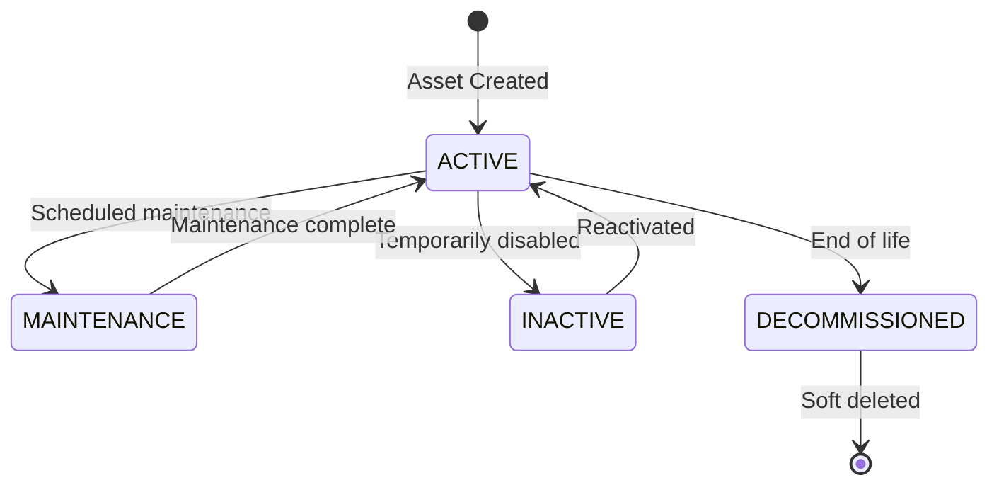

# Asset Table

> **IEKB Section:** 01 — Database | **Document:** 06-asset-table.md | **Last Updated:** 2026-07-16 | **Status:** Approved

---

## Overview

The `assets` table is the **core entity** of InfraWatch — it represents physical infrastructure items tracked by each organization. Assets have types, locations (geo-coordinates), flexible metadata (JSONB), and support soft deletion.

| Property | Value |
|----------|-------|
| **Table Name** | `assets` |
| **Primary Key** | `id` (SERIAL) |
| **Tenant Scoped** | Yes (`tenant_id`) |
| **Soft Delete** | Yes (`deleted_at`) |
| **Estimated Rows (Year 1)** | 5,000-50,000 |
| **JSONB Metadata** | Yes — extensible custom fields |
| **Geo Support** | Latitude/longitude (DECIMAL(10,7)) |

---

## Schema Definition

```sql
CREATE TABLE "assets" (
    "id"             SERIAL         PRIMARY KEY,
    "tenant_id"      INTEGER        NOT NULL REFERENCES "organizations"("id") ON DELETE RESTRICT,
    "asset_type_id"  INTEGER        REFERENCES "asset_types"("id") ON DELETE SET NULL,
    "created_by_id"  INTEGER        REFERENCES "users"("id") ON DELETE SET NULL,
    "name"           VARCHAR(255)   NOT NULL,
    "description"    TEXT,
    "latitude"       DECIMAL(10, 7),
    "longitude"      DECIMAL(10, 7),
    "address"        TEXT,
    "metadata"       JSONB          DEFAULT '{}',
    "status"         VARCHAR(20)    NOT NULL DEFAULT 'ACTIVE',
    "deleted_at"     TIMESTAMPTZ,
    "created_at"     TIMESTAMPTZ    NOT NULL DEFAULT NOW(),
    "updated_at"     TIMESTAMPTZ    NOT NULL DEFAULT NOW(),

    CONSTRAINT "ck_assets_valid_status"
        CHECK ("status" IN ('ACTIVE', 'INACTIVE', 'MAINTENANCE', 'DECOMMISSIONED')),
    CONSTRAINT "ck_assets_valid_latitude"
        CHECK ("latitude" IS NULL OR ("latitude" >= -90 AND "latitude" <= 90)),
    CONSTRAINT "ck_assets_valid_longitude"
        CHECK ("longitude" IS NULL OR ("longitude" >= -180 AND "longitude" <= 180))
);
```

---

## Column Reference

| Column | Type | Nullable | Default | Description |
|--------|------|----------|---------|-------------|
| `id` | `SERIAL` | No | Auto | Unique identifier. |
| `tenant_id` | `INTEGER` | No | — | FK to organizations. Tenant boundary. |
| `asset_type_id` | `INTEGER` | Yes | `NULL` | FK to asset_types. Category of this asset. |
| `created_by_id` | `INTEGER` | Yes | `NULL` | FK to users. Who created this asset. |
| `name` | `VARCHAR(255)` | No | — | Asset name (e.g., "Tower T-142", "Panel S-001"). |
| `description` | `TEXT` | Yes | `NULL` | Detailed description. |
| `latitude` | `DECIMAL(10,7)` | Yes | `NULL` | GPS latitude (-90 to 90). ~1cm precision. |
| `longitude` | `DECIMAL(10,7)` | Yes | `NULL` | GPS longitude (-180 to 180). ~1cm precision. |
| `address` | `TEXT` | Yes | `NULL` | Human-readable address. |
| `metadata` | `JSONB` | No | `'{}'` | Flexible custom fields per tenant. GIN-indexed. |
| `status` | `VARCHAR(20)` | No | `'ACTIVE'` | Asset status: ACTIVE, INACTIVE, MAINTENANCE, DECOMMISSIONED. |
| `deleted_at` | `TIMESTAMPTZ` | Yes | `NULL` | Soft delete timestamp. Non-null = deleted. |
| `created_at` | `TIMESTAMPTZ` | No | `NOW()` | Creation timestamp. |
| `updated_at` | `TIMESTAMPTZ` | No | `NOW()` | Last update timestamp. |

---

## Indexes

| Name | Columns | Type | Purpose |
|------|---------|------|---------|
| `idx_assets_tenant_id` | `(tenant_id)` | B-tree | Tenant-scoped queries |
| `idx_assets_tenant_id_status` | `(tenant_id, status)` WHERE `deleted_at IS NULL` | Partial B-tree | Active asset filtering |
| `idx_assets_tenant_id_asset_type_id` | `(tenant_id, asset_type_id)` | B-tree | Type-based filtering |
| `idx_assets_tenant_id_name` | `(tenant_id, name)` | B-tree | Name-based search |
| `idx_assets_metadata` | `(metadata)` | GIN | JSONB metadata queries |

---

## Status Lifecycle



---

## JSONB Metadata Examples

The `metadata` column allows tenants to store custom fields without schema changes:

```json
// Cellular Tower
{
  "height_meters": 45,
  "manufacturer": "Ericsson",
  "frequency_bands": ["700MHz", "1800MHz", "2100MHz"],
  "power_backup": true,
  "last_painted": "2025-06-15",
  "structural_grade": "A"
}

// Solar Panel Array
{
  "panel_count": 120,
  "capacity_kw": 30,
  "tilt_angle": 25,
  "manufacturer": "Trina Solar",
  "inverter_type": "String",
  "commissioning_date": "2024-03-10"
}

// Construction Crane
{
  "max_load_tons": 8,
  "boom_length_meters": 50,
  "certification_expiry": "2026-12-31",
  "operator_license": "CRN-2024-001"
}
```

### Querying JSONB Metadata

```sql
-- Find all towers taller than 40 meters
SELECT * FROM assets
WHERE tenant_id = 1
  AND deleted_at IS NULL
  AND (metadata->>'height_meters')::int > 40;

-- Find assets with specific manufacturer
SELECT * FROM assets
WHERE tenant_id = 1
  AND metadata @> '{"manufacturer": "Ericsson"}';

-- Find assets with power backup
SELECT * FROM assets
WHERE tenant_id = 1
  AND metadata @> '{"power_backup": true}';
```

---

## Common Queries

### Create Asset

```typescript
async create(tenantId: number, userId: number, data: CreateAssetDto): Promise<Asset> {
  // Validate asset type belongs to this tenant
  if (data.assetTypeId) {
    const assetType = await prisma.assetType.findFirst({
      where: { id: data.assetTypeId, tenantId },
    });
    if (!assetType) throw new AppError('ASSET_TYPE_NOT_FOUND', 'Asset type not found', 404);
  }

  return prisma.asset.create({
    data: {
      tenantId,
      createdById: userId,
      name: data.name,
      description: data.description,
      assetTypeId: data.assetTypeId,
      latitude: data.latitude,
      longitude: data.longitude,
      address: data.address,
      metadata: data.metadata || {},
    },
    include: { assetType: true },
  });
}
```

### List Assets with Filtering

```typescript
async list(tenantId: number, options: AssetListOptions): Promise<PaginatedResult<Asset>> {
  const { page, limit, search, typeId, status } = options;

  const where: Prisma.AssetWhereInput = {
    tenantId,
    deletedAt: null, // Exclude soft-deleted
    ...(search && { name: { contains: search, mode: 'insensitive' } }),
    ...(typeId && { assetTypeId: typeId }),
    ...(status && { status }),
  };

  const [items, total] = await Promise.all([
    prisma.asset.findMany({
      where, skip: (page - 1) * limit, take: limit,
      orderBy: { createdAt: 'desc' },
      include: {
        assetType: { select: { id: true, name: true, icon: true } },
        _count: { select: { cameras: true, inspections: true, incidents: true } },
      },
    }),
    prisma.asset.count({ where }),
  ]);

  return { items, total, page, limit, totalPages: Math.ceil(total / limit) };
}
```

### Soft Delete Asset

```typescript
async softDelete(tenantId: number, assetId: number): Promise<void> {
  const asset = await prisma.asset.findFirst({ where: { id: assetId, tenantId, deletedAt: null } });
  if (!asset) throw new AppError('ASSET_NOT_FOUND', 'Asset not found', 404);

  await prisma.asset.update({
    where: { id: assetId },
    data: { deletedAt: new Date(), status: 'DECOMMISSIONED' },
  });
}
```

### Geo-Based Query (Assets Near Location)

```sql
-- Find assets within 10km of a point
SELECT id, name, latitude, longitude,
  (6371 * acos(
    cos(radians(28.6139)) * cos(radians(latitude)) *
    cos(radians(longitude) - radians(77.2090)) +
    sin(radians(28.6139)) * sin(radians(latitude))
  )) AS distance_km
FROM assets
WHERE tenant_id = 1
  AND deleted_at IS NULL
  AND latitude IS NOT NULL
HAVING distance_km < 10
ORDER BY distance_km;
```

### Dashboard Aggregation

```sql
SELECT
  status,
  COUNT(*) AS count
FROM assets
WHERE tenant_id = $1 AND deleted_at IS NULL
GROUP BY status;
```

---

## Business Rules

| Rule | Enforcement |
|------|-------------|
| Asset name required | DB NOT NULL + Zod validation |
| Valid coordinates | DB CHECK constraints (lat: -90 to 90, lng: -180 to 180) |
| Soft delete preserves history | Application sets `deleted_at` instead of DELETE |
| Soft-deleted assets excluded by default | All queries add `deletedAt: null` |
| Asset type must belong to same tenant | Application validation before create |
| Cannot hard-delete assets with inspections/incidents | FK RESTRICT constraints |
| Metadata is free-form per tenant | JSONB type, no schema enforcement (tenant manages meaning) |

---

## Seed Data

```typescript
const assets = [
  // TowerNet
  { tenantId: 1, assetTypeId: 1, name: 'Tower T-142', latitude: 28.6139, longitude: 77.2090, address: 'Connaught Place, New Delhi', status: 'ACTIVE', metadata: { height_meters: 45, manufacturer: 'Ericsson' } },
  { tenantId: 1, assetTypeId: 1, name: 'Tower T-205', latitude: 19.0760, longitude: 72.8777, address: 'Bandra, Mumbai', status: 'ACTIVE', metadata: { height_meters: 38, manufacturer: 'Nokia' } },
  { tenantId: 1, assetTypeId: 1, name: 'Tower T-089', latitude: 12.9716, longitude: 77.5946, address: 'MG Road, Bangalore', status: 'MAINTENANCE', metadata: { height_meters: 52, manufacturer: 'Huawei' } },
  { tenantId: 1, assetTypeId: 2, name: 'Fiber Node FN-12', latitude: 28.6280, longitude: 77.2190, address: 'Karol Bagh, New Delhi', status: 'ACTIVE' },
  // SolarPower
  { tenantId: 2, assetTypeId: 4, name: 'Array SP-001', latitude: 26.9124, longitude: 75.7873, address: 'Solar Park, Jaipur', status: 'ACTIVE', metadata: { panel_count: 120, capacity_kw: 30 } },
  { tenantId: 2, assetTypeId: 4, name: 'Array SP-002', latitude: 26.9200, longitude: 75.7900, address: 'Solar Park Block B, Jaipur', status: 'ACTIVE', metadata: { panel_count: 150, capacity_kw: 37.5 } },
  { tenantId: 2, assetTypeId: 5, name: 'Inverter INV-A1', latitude: 26.9150, longitude: 75.7880, address: 'Solar Park Control Room', status: 'ACTIVE', metadata: { capacity_kw: 100 } },
];
```

---

## Related Documents

- **Previous:** [Asset Type Table](./05-asset-type-table.md) | **Next:** [Camera Table](./07-camera-table.md)
- **Service:** [Asset Service](../03-backend/06-asset-service.md) | **API:** [Asset & Camera Endpoints](../04-api/04-asset-camera-endpoints.md)
- **Frontend:** [Asset Management Pages](../05-frontend/06-asset-management-pages.md) | **Index:** [IEKB Master Index](../00-foundation/00-IEKB-index.md)
