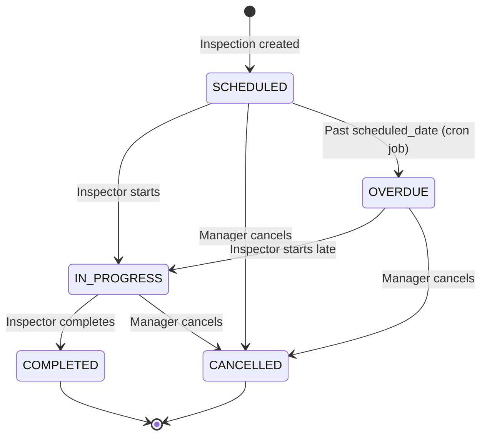

# Inspection Tables

> **IEKB Section:** 01 — Database | **Document:** 08-inspection-tables.md | **Last Updated:** 2026-07-16 | **Status:** Approved

---

## Overview

Inspections are a core InfraWatch workflow — field inspectors visit assets, conduct surveys, attach photos, and record findings. This document covers both the `inspections` table and its child `inspection_images` table.

---

## Inspections Table

```sql
CREATE TABLE "inspections" (
    "id"             SERIAL       PRIMARY KEY,
    "tenant_id"      INTEGER      NOT NULL REFERENCES "organizations"("id") ON DELETE RESTRICT,
    "asset_id"       INTEGER      NOT NULL REFERENCES "assets"("id") ON DELETE RESTRICT,
    "inspector_id"   INTEGER      REFERENCES "users"("id") ON DELETE SET NULL,
    "scheduled_date" DATE         NOT NULL,
    "completed_at"   TIMESTAMPTZ,
    "notes"          TEXT,
    "status"         VARCHAR(20)  NOT NULL DEFAULT 'SCHEDULED',
    "created_at"     TIMESTAMPTZ  NOT NULL DEFAULT NOW(),
    "updated_at"     TIMESTAMPTZ  NOT NULL DEFAULT NOW(),

    CONSTRAINT "ck_inspections_valid_status"
        CHECK ("status" IN ('SCHEDULED', 'IN_PROGRESS', 'COMPLETED', 'CANCELLED', 'OVERDUE'))
);
```

### Status Lifecycle



### Column Reference

| Column | Type | Nullable | Default | Description |
|--------|------|----------|---------|-------------|
| `id` | `SERIAL` | No | Auto | Unique identifier. |
| `tenant_id` | `INTEGER` | No | — | FK to organizations. |
| `asset_id` | `INTEGER` | No | — | FK to assets. The asset being inspected. |
| `inspector_id` | `INTEGER` | Yes | `NULL` | FK to users. Assigned inspector. Null = unassigned. |
| `scheduled_date` | `DATE` | No | — | Date the inspection is scheduled for. |
| `completed_at` | `TIMESTAMPTZ` | Yes | `NULL` | When the inspection was completed. |
| `notes` | `TEXT` | Yes | `NULL` | Inspector's notes and findings. |
| `status` | `VARCHAR(20)` | No | `'SCHEDULED'` | Current status. |
| `created_at` | `TIMESTAMPTZ` | No | `NOW()` | Creation timestamp. |
| `updated_at` | `TIMESTAMPTZ` | No | `NOW()` | Last update timestamp. |

---

## Inspection Images Table

```sql
CREATE TABLE "inspection_images" (
    "id"            SERIAL       PRIMARY KEY,
    "inspection_id" INTEGER      NOT NULL REFERENCES "inspections"("id") ON DELETE CASCADE,
    "camera_id"     INTEGER      REFERENCES "cameras"("id") ON DELETE SET NULL,
    "image_url"     TEXT         NOT NULL,
    "thumbnail_url" TEXT,
    "file_size"     BIGINT,
    "mime_type"     VARCHAR(50)  DEFAULT 'image/jpeg',
    "exif_data"     JSONB        DEFAULT '{}',
    "captured_at"   TIMESTAMPTZ,
    "created_at"    TIMESTAMPTZ  NOT NULL DEFAULT NOW(),

    CONSTRAINT "ck_inspection_images_valid_mime"
        CHECK ("mime_type" IN ('image/jpeg', 'image/png', 'image/webp', 'image/heic'))
);
```

### Image Storage Pattern

```
S3 Bucket: infrawatch-{env}
├── inspections/
│   └── {tenant_id}/
│       └── {inspection_id}/
│           ├── original/
│           │   ├── img_001.jpg    ← Full resolution upload
│           │   └── img_002.jpg
│           └── thumbnails/
│               ├── img_001_thumb.webp  ← 400x300 thumbnail
│               └── img_002_thumb.webp
```

---

## Common Queries

### Create Inspection

```typescript
async create(tenantId: number, data: CreateInspectionDto): Promise<Inspection> {
  const asset = await prisma.asset.findFirst({ where: { id: data.assetId, tenantId, deletedAt: null } });
  if (!asset) throw new AppError('ASSET_NOT_FOUND', 'Asset not found', 404);

  if (data.inspectorId) {
    const inspector = await prisma.user.findFirst({
      where: { id: data.inspectorId, tenantId, isActive: true, role: { in: ['INSPECTOR', 'MANAGER'] } },
    });
    if (!inspector) throw new AppError('INSPECTOR_NOT_FOUND', 'Inspector not found', 404);
  }

  return prisma.inspection.create({
    data: { tenantId, assetId: data.assetId, inspectorId: data.inspectorId, scheduledDate: data.scheduledDate },
    include: { asset: { select: { id: true, name: true } }, inspector: { select: { id: true, name: true } } },
  });
}
```

### Complete Inspection

```typescript
async complete(tenantId: number, inspectionId: number, data: CompleteInspectionDto): Promise<Inspection> {
  const inspection = await prisma.inspection.findFirst({
    where: { id: inspectionId, tenantId, status: { in: ['SCHEDULED', 'IN_PROGRESS', 'OVERDUE'] } },
  });
  if (!inspection) throw new AppError('INSPECTION_NOT_FOUND', 'Inspection not found or already completed', 404);

  return prisma.inspection.update({
    where: { id: inspectionId },
    data: { status: 'COMPLETED', completedAt: new Date(), notes: data.notes },
  });
}
```

### Add Image to Inspection

```typescript
async addImage(inspectionId: number, data: AddImageDto): Promise<InspectionImage> {
  return prisma.inspectionImage.create({
    data: {
      inspectionId,
      imageUrl: data.imageUrl,
      thumbnailUrl: data.thumbnailUrl,
      fileSize: data.fileSize,
      mimeType: data.mimeType,
      cameraId: data.cameraId,
      capturedAt: data.capturedAt || new Date(),
    },
  });
}
```

### Mark Overdue Inspections (Cron Job)

```sql
-- Run daily at midnight UTC
UPDATE inspections
SET status = 'OVERDUE', updated_at = NOW()
WHERE status = 'SCHEDULED'
  AND scheduled_date < CURRENT_DATE;
```

```typescript
// Cron job implementation
async markOverdueInspections(): Promise<number> {
  const result = await prisma.inspection.updateMany({
    where: { status: 'SCHEDULED', scheduledDate: { lt: new Date() } },
    data: { status: 'OVERDUE' },
  });
  logger.info(`Marked ${result.count} inspections as overdue`);
  return result.count;
}
```

### Inspection Compliance Report

```sql
SELECT
  DATE_TRUNC('month', scheduled_date) AS month,
  COUNT(*) AS total_scheduled,
  COUNT(*) FILTER (WHERE status = 'COMPLETED') AS completed,
  COUNT(*) FILTER (WHERE status = 'OVERDUE') AS overdue,
  COUNT(*) FILTER (WHERE status = 'CANCELLED') AS cancelled,
  ROUND(
    COUNT(*) FILTER (WHERE status = 'COMPLETED')::decimal /
    NULLIF(COUNT(*), 0) * 100, 1
  ) AS compliance_rate
FROM inspections
WHERE tenant_id = $1
  AND scheduled_date >= $2
  AND scheduled_date <= $3
GROUP BY DATE_TRUNC('month', scheduled_date)
ORDER BY month;
```

### Dashboard: Upcoming Inspections

```typescript
async getUpcoming(tenantId: number, days: number = 7): Promise<Inspection[]> {
  const futureDate = new Date();
  futureDate.setDate(futureDate.getDate() + days);

  return prisma.inspection.findMany({
    where: {
      tenantId,
      status: { in: ['SCHEDULED', 'OVERDUE'] },
      scheduledDate: { lte: futureDate },
    },
    orderBy: { scheduledDate: 'asc' },
    take: 20,
    include: {
      asset: { select: { id: true, name: true } },
      inspector: { select: { id: true, name: true } },
    },
  });
}
```

---

## Business Rules

| Rule | Enforcement |
|------|-------------|
| Asset must belong to same tenant | Application validation |
| Inspector must be INSPECTOR or MANAGER role | Application validation |
| Cannot complete a CANCELLED inspection | Application status check |
| Scheduled date must be today or future (on creation) | Zod validation |
| Overdue marking runs daily via cron | Scheduled job |
| Images cascade-delete with inspection | FK ON DELETE CASCADE |
| Max 20 images per inspection | Application validation |
| Accepted image formats: JPEG, PNG, WebP, HEIC | DB CHECK + Zod validation |

---

## Seed Data

```typescript
const inspections = [
  { tenantId: 1, assetId: 1, inspectorId: 2, scheduledDate: '2026-07-20', status: 'SCHEDULED' },
  { tenantId: 1, assetId: 2, inspectorId: 4, scheduledDate: '2026-07-18', status: 'SCHEDULED' },
  { tenantId: 1, assetId: 3, inspectorId: 2, scheduledDate: '2026-07-10', status: 'COMPLETED', completedAt: '2026-07-10T14:30:00Z', notes: 'Tower structure intact. Minor rust on base plate. Recommend repainting within 3 months.' },
  { tenantId: 2, assetId: 5, inspectorId: null, scheduledDate: '2026-07-22', status: 'SCHEDULED' },
];
```

---

## Related Documents

- **Previous:** [Camera Table](./07-camera-table.md) | **Next:** [Incident Table](./09-incident-table.md)
- **Service:** [Inspection Service](../03-backend/08-inspection-service.md) | **API:** [Inspection Endpoints](../04-api/05-inspection-endpoints.md)
- **Frontend:** [Inspection Pages](../05-frontend/08-inspection-pages.md) | **Worker:** [Image Processing](../06-workers/02-image-processing-worker.md)
- **Index:** [IEKB Master Index](../00-foundation/00-IEKB-index.md)
