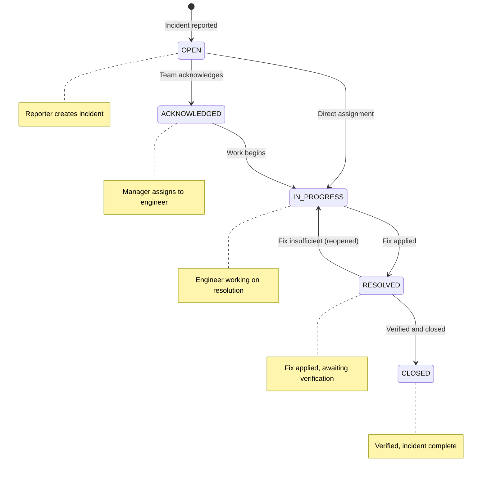

# Incident Table

> **IEKB Section:** 01 — Database | **Document:** 09-incident-table.md | **Last Updated:** 2026-07-16 | **Status:** Approved

---

## Overview

The `incidents` table tracks reported problems, damage, safety hazards, and anomalies associated with assets. Incidents have a full lifecycle with status transitions, severity levels, and assignment workflows.

| Property | Value |
|----------|-------|
| **Table Name** | `incidents` |
| **Primary Key** | `id` (SERIAL) |
| **Tenant Scoped** | Yes (`tenant_id`) |
| **Soft Delete** | Yes (`deleted_at`) |
| **Estimated Rows (Year 1)** | 10,000-100,000 |
| **Child Tables** | `incident_comments`, `incident_attachments` |

---

## Schema Definition

```sql
CREATE TABLE "incidents" (
    "id"              SERIAL       PRIMARY KEY,
    "tenant_id"       INTEGER      NOT NULL REFERENCES "organizations"("id") ON DELETE RESTRICT,
    "asset_id"        INTEGER      REFERENCES "assets"("id") ON DELETE SET NULL,
    "reported_by_id"  INTEGER      NOT NULL REFERENCES "users"("id") ON DELETE RESTRICT,
    "assigned_to_id"  INTEGER      REFERENCES "users"("id") ON DELETE SET NULL,
    "title"           VARCHAR(500) NOT NULL,
    "description"     TEXT,
    "severity"        VARCHAR(20)  NOT NULL DEFAULT 'MEDIUM',
    "status"          VARCHAR(20)  NOT NULL DEFAULT 'OPEN',
    "source"          VARCHAR(20)  NOT NULL DEFAULT 'MANUAL',
    "resolved_at"     TIMESTAMPTZ,
    "closed_at"       TIMESTAMPTZ,
    "deleted_at"      TIMESTAMPTZ,
    "created_at"      TIMESTAMPTZ  NOT NULL DEFAULT NOW(),
    "updated_at"      TIMESTAMPTZ  NOT NULL DEFAULT NOW(),

    CONSTRAINT "ck_incidents_valid_severity"
        CHECK ("severity" IN ('LOW', 'MEDIUM', 'HIGH', 'CRITICAL')),
    CONSTRAINT "ck_incidents_valid_status"
        CHECK ("status" IN ('OPEN', 'ACKNOWLEDGED', 'IN_PROGRESS', 'RESOLVED', 'CLOSED')),
    CONSTRAINT "ck_incidents_valid_source"
        CHECK ("source" IN ('MANUAL', 'INSPECTION', 'AI', 'SENSOR', 'EXTERNAL'))
);
```

---

## Status Lifecycle



### Valid Status Transitions

| From | To | Who Can Transition | Notes |
|------|----|--------------------|-------|
| OPEN | ACKNOWLEDGED | MANAGER, ADMIN | Acknowledges receipt |
| OPEN | IN_PROGRESS | MANAGER, ADMIN | Skip acknowledge, direct assign |
| ACKNOWLEDGED | IN_PROGRESS | MANAGER, ADMIN, assigned INSPECTOR | Work begins |
| IN_PROGRESS | RESOLVED | MANAGER, ADMIN, assigned INSPECTOR | Fix applied |
| RESOLVED | CLOSED | MANAGER, ADMIN | Verified |
| RESOLVED | IN_PROGRESS | MANAGER, ADMIN | Reopened |

---

## Severity Levels

| Severity | SLA (Acknowledge) | SLA (Resolve) | Description | Examples |
|----------|-------------------|---------------|-------------|---------|
| `CRITICAL` | 15 minutes | 1 hour | Immediate safety risk or complete service outage | Fire, structural collapse, live wire exposure |
| `HIGH` | 1 hour | 4 hours | Major operational impact or safety concern | Significant structural damage, equipment failure, security breach |
| `MEDIUM` | 4 hours | 24 hours | Moderate impact, requires attention | Minor damage, degraded performance, scheduled maintenance needed |
| `LOW` | 24 hours | 1 week | Minor issue, no immediate impact | Cosmetic damage, minor wear, documentation updates |

---

## Source Types

| Source | Description | V0/V1.1 |
|--------|------------|---------|
| `MANUAL` | User-created via web/mobile UI | V0 |
| `INSPECTION` | Created during an inspection workflow | V0 |
| `AI` | Auto-detected by computer vision/ML models | V1.1 |
| `SENSOR` | Triggered by IoT sensor threshold | V1.1 |
| `EXTERNAL` | Created via API integration (third party) | V0 |

---

## Common Queries

### Create Incident

```typescript
async create(tenantId: number, userId: number, data: CreateIncidentDto): Promise<Incident> {
  const incident = await prisma.incident.create({
    data: {
      tenantId,
      reportedById: userId,
      assetId: data.assetId,
      title: data.title,
      description: data.description,
      severity: data.severity || 'MEDIUM',
      source: data.source || 'MANUAL',
    },
    include: {
      asset: { select: { id: true, name: true } },
      reportedBy: { select: { id: true, name: true } },
    },
  });

  // Trigger notification
  await notificationService.notifyNewIncident(tenantId, incident);

  // Create audit log
  await auditService.log(tenantId, userId, 'CREATE', 'INCIDENT', incident.id, null, incident);

  return incident;
}
```

### Update Status (with Transition Validation)

```typescript
const VALID_TRANSITIONS: Record<string, string[]> = {
  OPEN: ['ACKNOWLEDGED', 'IN_PROGRESS'],
  ACKNOWLEDGED: ['IN_PROGRESS'],
  IN_PROGRESS: ['RESOLVED'],
  RESOLVED: ['CLOSED', 'IN_PROGRESS'],
};

async updateStatus(tenantId: number, incidentId: number, newStatus: string, userId: number): Promise<Incident> {
  const incident = await prisma.incident.findFirst({
    where: { id: incidentId, tenantId, deletedAt: null },
  });
  if (!incident) throw new AppError('INCIDENT_NOT_FOUND', 'Incident not found', 404);

  const validNext = VALID_TRANSITIONS[incident.status];
  if (!validNext?.includes(newStatus)) {
    throw new AppError('INVALID_TRANSITION', `Cannot transition from ${incident.status} to ${newStatus}`, 400);
  }

  const updateData: any = { status: newStatus };
  if (newStatus === 'RESOLVED') updateData.resolvedAt = new Date();
  if (newStatus === 'CLOSED') updateData.closedAt = new Date();
  if (newStatus === 'IN_PROGRESS' && incident.status === 'RESOLVED') {
    updateData.resolvedAt = null; // Reopen
  }

  return prisma.incident.update({
    where: { id: incidentId },
    data: updateData,
    include: { asset: true, reportedBy: true, assignedTo: true },
  });
}
```

### Assign Incident

```typescript
async assign(tenantId: number, incidentId: number, assigneeId: number): Promise<Incident> {
  const assignee = await prisma.user.findFirst({
    where: { id: assigneeId, tenantId, isActive: true },
  });
  if (!assignee) throw new AppError('USER_NOT_FOUND', 'Assignee not found', 404);

  const incident = await prisma.incident.update({
    where: { id: incidentId, tenantId },
    data: {
      assignedToId: assigneeId,
      status: 'IN_PROGRESS',
    },
  });

  await notificationService.notifyIncidentAssignment(tenantId, incident, assignee);
  return incident;
}
```

### Dashboard: Incident Summary

```sql
SELECT
  severity,
  status,
  COUNT(*) AS count
FROM incidents
WHERE tenant_id = $1
  AND deleted_at IS NULL
GROUP BY severity, status
ORDER BY
  CASE severity WHEN 'CRITICAL' THEN 1 WHEN 'HIGH' THEN 2 WHEN 'MEDIUM' THEN 3 WHEN 'LOW' THEN 4 END,
  CASE status WHEN 'OPEN' THEN 1 WHEN 'ACKNOWLEDGED' THEN 2 WHEN 'IN_PROGRESS' THEN 3 WHEN 'RESOLVED' THEN 4 WHEN 'CLOSED' THEN 5 END;
```

### Incident Trend (Last 30 Days)

```sql
SELECT
  DATE(created_at) AS day,
  COUNT(*) AS incidents_created,
  COUNT(*) FILTER (WHERE status = 'CLOSED') AS incidents_closed
FROM incidents
WHERE tenant_id = $1
  AND deleted_at IS NULL
  AND created_at >= NOW() - INTERVAL '30 days'
GROUP BY DATE(created_at)
ORDER BY day;
```

---

## Child Tables

### Incident Comments

```sql
CREATE TABLE "incident_comments" (
    "id"          SERIAL       PRIMARY KEY,
    "incident_id" INTEGER      NOT NULL REFERENCES "incidents"("id") ON DELETE CASCADE,
    "user_id"     INTEGER      NOT NULL REFERENCES "users"("id") ON DELETE RESTRICT,
    "content"     TEXT         NOT NULL,
    "created_at"  TIMESTAMPTZ  NOT NULL DEFAULT NOW()
);
```

### Incident Attachments

```sql
CREATE TABLE "incident_attachments" (
    "id"          SERIAL       PRIMARY KEY,
    "incident_id" INTEGER      NOT NULL REFERENCES "incidents"("id") ON DELETE CASCADE,
    "file_url"    TEXT         NOT NULL,
    "file_name"   VARCHAR(255) NOT NULL,
    "file_type"   VARCHAR(50)  NOT NULL,
    "file_size"   BIGINT       NOT NULL DEFAULT 0,
    "created_at"  TIMESTAMPTZ  NOT NULL DEFAULT NOW()
);
```

---

## Business Rules

| Rule | Enforcement |
|------|-------------|
| Title required (3-500 chars) | Zod validation |
| Valid severity | DB CHECK constraint |
| Valid status transition | Application logic (`VALID_TRANSITIONS` map) |
| Only MANUAL and INSPECTION sources in V0 | Application validation |
| Cannot delete with comments | Cascade deletes comments with incident |
| `resolved_at` set automatically on RESOLVED status | Application logic |
| `closed_at` set automatically on CLOSED status | Application logic |
| Notification on new incident (CRITICAL/HIGH) | Application logic → BullMQ job |
| Notification on assignment | Application logic → BullMQ job |
| Soft delete preserves audit trail | Application sets `deleted_at` |

---

## Seed Data

```typescript
const incidents = [
  { tenantId: 1, assetId: 1, reportedById: 2, title: 'Structural crack on Tower T-142 base', description: 'Noticed a 2cm crack on the north-facing base plate during routine inspection. Crack appears to be spreading.', severity: 'HIGH', status: 'OPEN', source: 'INSPECTION' },
  { tenantId: 1, assetId: 2, reportedById: 4, title: 'Antenna misalignment on Tower T-205', description: 'Top antenna array tilted approximately 5 degrees. Signal degradation reported by NOC.', severity: 'MEDIUM', status: 'ACKNOWLEDGED', source: 'MANUAL', assignedToId: 2 },
  { tenantId: 1, assetId: 3, reportedById: 3, title: 'Power backup failure at Tower T-089', description: 'Diesel generator failed to start during load shedding test.', severity: 'CRITICAL', status: 'IN_PROGRESS', source: 'MANUAL', assignedToId: 2 },
  { tenantId: 2, assetId: 5, reportedById: 5, title: 'Cracked solar panel in Array SP-001', description: 'Panel A3-R7 has visible crack after recent hailstorm. Output reduced by ~15%.', severity: 'MEDIUM', status: 'OPEN', source: 'INSPECTION' },
];
```

---

## Related Documents

- **Previous:** [Inspection Tables](./08-inspection-tables.md) | **Next:** [Indexing & Performance](./10-indexing-performance.md)
- **Service:** [Incident Service](../03-backend/09-incident-service.md) | **API:** [Incident Endpoints](../04-api/06-incident-endpoints.md)
- **Frontend:** [Incident Pages](../05-frontend/09-incident-pages.md) | **Notifications:** [Notification Service](../03-backend/11-notification-service.md)
- **Index:** [IEKB Master Index](../00-foundation/00-IEKB-index.md)
