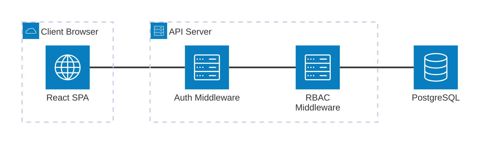

# Authentication & Authorization Overview

> **IEKB Section:** 02 — Auth  
> **Document:** 00-auth-overview.md  
> **Last Updated:** 2026-07-16  
> **Owner:** Security Engineer  
> **Status:** Approved

---

## Table of Contents

1. [Auth Architecture](#auth-architecture)
2. [Authentication Flow](#authentication-flow)
3. [Authorization Model (RBAC)](#authorization-model-rbac)
4. [Multi-Tenancy Integration](#multi-tenancy-integration)
5. [Security Controls](#security-controls)
6. [V1.1 Auth Roadmap](#v11-auth-roadmap)
7. [Related Documents](#related-documents)

---

## Auth Architecture

InfraWatch uses a **token-based authentication architecture** designed for a stateless backend (Express/Node.js) and a single-page application frontend (React). 

### Key Components

1. **Identity Provider:** Internal database (V0), with extensible architecture for SSO/SAML (V1.1).
2. **Tokens:** JSON Web Tokens (JWT) for stateless authentication.
3. **Transport:** HTTPS only. Tokens are stored in HttpOnly cookies (refresh) and memory (access).
4. **Access Control:** Role-Based Access Control (RBAC) enforced via Express middleware.
5. **Tenant Isolation:** Every auth action is strictly scoped to a `tenant_id`.



---

## Authentication Flow

InfraWatch implements a **Dual-Token pattern** (short-lived Access Token, long-lived Refresh Token).

### Login Flow

1. User submits email/password to `/api/v1/auth/login`.
2. Backend verifies credentials against database.
3. Backend generates:
   - **Access Token:** Short-lived (15 minutes), returned in JSON response.
   - **Refresh Token:** Long-lived (7 days), set as an `HttpOnly`, `Secure`, `SameSite=Strict` cookie.
4. Client stores Access Token in memory (React state / Zustand).

### Token Refresh Flow

1. Client detects Access Token is expired (or receives 401 Unauthorized).
2. Client calls `/api/v1/auth/refresh`.
3. Backend reads Refresh Token from the HttpOnly cookie.
4. Backend verifies Refresh Token against database (checking for revocation).
5. If valid, backend returns a new Access Token.

### Logout Flow

1. Client calls `/api/v1/auth/logout`.
2. Backend revokes the Refresh Token in the database.
3. Backend clears the HttpOnly cookie.
4. Client discards the Access Token from memory.

---

## Authorization Model (RBAC)

InfraWatch uses **Role-Based Access Control (RBAC)**. Permissions are assigned to roles, and roles are assigned to users. In V0, a user has exactly **one role per organization**.

### V0 Roles

| Role | Scope | Primary User Persona |
|------|-------|----------------------|
| **ADMIN** | Full organization access | IT Admin, Org Owner |
| **MANAGER** | Operational management | Operations Manager, Maintenance Lead |
| **INSPECTOR** | Field operations only | Field Technician, Inspector |

### Enforcement Layers

1. **Route Level:** `requireRole()` middleware blocks unauthorized HTTP requests.
2. **Service Level:** Business logic double-checks permissions for complex operations (e.g., "Inspector can only edit inspections assigned to them").
3. **UI Level:** React components hide buttons/links that the user lacks permissions for.

---

## Multi-Tenancy Integration

In InfraWatch, authentication is inextricably linked to multi-tenancy. **A user does not exist globally; a user exists within a tenant.**

### The "Tenant Context"

When a user logs in, the JWT Access Token payload includes both their `userId` and their `tenantId`.

```json
// Example JWT Payload
{
  "sub": 142,
  "email": "priya@towernet.com",
  "tenantId": 1,
  "role": "INSPECTOR",
  "iat": 1678886400,
  "exp": 1678887300
}
```

Every protected API route passes through the `tenantMiddleware`, which extracts the `tenantId` from the verified JWT and attaches it to the request object (`req.tenantContext`). This guarantees that all subsequent database queries are scoped to that tenant.

---

## Security Controls

| Threat | Mitigation Strategy | Implementation |
|--------|---------------------|----------------|
| **XSS Token Theft** | Access token in memory, Refresh token in HttpOnly cookie | React prevents DOM access; browser prevents cookie access via JS. |
| **CSRF Attacks** | Access tokens sent via Authorization header | Browser cannot automatically attach the Auth header on cross-site requests. |
| **Brute Force** | Rate limiting by IP and Email | `express-rate-limit` + Redis store on auth routes (5 attempts / 15 min). |
| **Compromised Tokens** | Short-lived access tokens (15m) + revocable refresh tokens | Refresh tokens stored as hashes in DB; can be revoked on demand. |
| **Session Fixation** | New tokens generated on every login | Old tokens are invalidated/ignored. |
| **Insecure Transport** | TLS 1.3 requirement | Load balancer terminates SSL; HSTS headers enforced via Helmet. |

---

## V1.1 Auth Roadmap

While V0 relies exclusively on internal email/password authentication, V1.1 will introduce enterprise identity features:

1. **SAML 2.0 / OIDC Integration:** Allowing enterprise tenants (like TowerNet) to use Okta, Azure AD, or Google Workspace for SSO.
2. **API Keys:** Permitting tenants to generate service-account API keys for external integrations.
3. **MFA (Multi-Factor Authentication):** Enforcing TOTP (Authenticator App) or WebAuthn for high-privilege roles (ADMIN).

---

## Related Documents

- **Next:** [JWT Implementation](./01-jwt-implementation.md)
- **Security:** [Password Security](./02-password-security.md)
- **Authorization:** [RBAC Model](./03-rbac-model.md)
- **Multi-Tenancy:** [Tenant Context](./04-tenant-context.md)
- **Index:** [IEKB Master Index](../00-foundation/00-IEKB-index.md)
