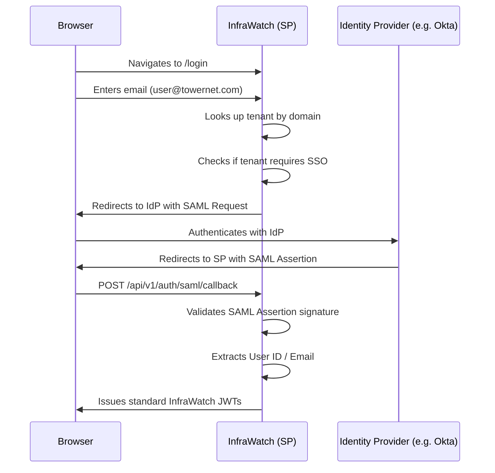

# SSO & SAML Integration (V1.1 Roadmap)

> **IEKB Section:** 02 — Auth  
> **Document:** 05-sso-integration.md  
> **Last Updated:** 2026-07-16  
> **Owner:** Security Engineer  
> **Status:** Planned for V1.1

---

## Table of Contents

1. [Overview](#overview)
2. [SAML 2.0 Flow](#saml-20-flow)
3. [Tenant Domain Mapping](#tenant-domain-mapping)
4. [Just-in-Time (JIT) Provisioning](#just-in-time-jit-provisioning)
5. [Database Schema Additions](#database-schema-additions)
6. [Related Documents](#related-documents)

---

## Overview

While InfraWatch V0 relies on internal email/password authentication, **V1.1 will introduce Single Sign-On (SSO)** support for Enterprise-tier tenants. This allows organizations to use their existing Identity Providers (IdP) like Okta, Azure AD, or Google Workspace to manage access to InfraWatch.

We will implement **SAML 2.0** as the primary SSO protocol, given its ubiquity in enterprise environments.

---

## SAML 2.0 Flow

InfraWatch will act as the **Service Provider (SP)**. We will support SP-initiated SSO.



---

## Tenant Domain Mapping

SSO configuration is bound to the `organizations` table via the `domain` column. 

When a user enters their email address on the login page:
1. The frontend extracts the domain (e.g., `towernet.com` from `alice@towernet.com`).
2. The frontend calls `/api/v1/auth/discover?domain=towernet.com`.
3. If the domain is mapped to an SSO-enabled tenant, the backend returns the SSO redirect URL.
4. If not, the frontend prompts for a password.

---

## Just-in-Time (JIT) Provisioning

When a user successfully authenticates via the IdP but does not exist in the InfraWatch `users` table, we will automatically provision them (JIT provisioning).

### Role Mapping

By default, JIT-provisioned users are assigned the `INSPECTOR` role. 

Tenants can configure **Group-to-Role Mapping** in their Org Settings:
- If IdP Group = "InfraWatch Admins" ➔ Assign `ADMIN` role
- If IdP Group = "Maintenance Team" ➔ Assign `MANAGER` role

---

## Database Schema Additions

To support SSO, the following additions will be made to the schema in V1.1:

```sql
-- Store IdP configuration per tenant
CREATE TABLE "sso_configurations" (
    "id" SERIAL PRIMARY KEY,
    "tenant_id" INTEGER NOT NULL UNIQUE REFERENCES "organizations"("id"),
    "idp_entity_id" VARCHAR(255) NOT NULL,
    "idp_sso_url" VARCHAR(255) NOT NULL,
    "idp_x509_cert" TEXT NOT NULL,
    "sp_entity_id" VARCHAR(255) NOT NULL,
    "require_sso" BOOLEAN DEFAULT false, -- If true, passwords are disabled for this tenant
    "role_mapping" JSONB DEFAULT '{}',
    "created_at" TIMESTAMPTZ DEFAULT NOW(),
    "updated_at" TIMESTAMPTZ DEFAULT NOW()
);

-- Modify Users table to track SSO users
ALTER TABLE "users" 
ADD COLUMN "auth_provider" VARCHAR(20) DEFAULT 'LOCAL', -- LOCAL or SAML
ADD COLUMN "idp_subject_id" VARCHAR(255); -- Unique ID from the IdP
```

---

## Related Documents

- **Auth Overview:** [Auth Overview](./00-auth-overview.md)
- **Roadmap:** [V1.1 Roadmap](../13-ai/00-ai-roadmap.md)
- **Index:** [IEKB Master Index](../00-foundation/00-IEKB-index.md)
