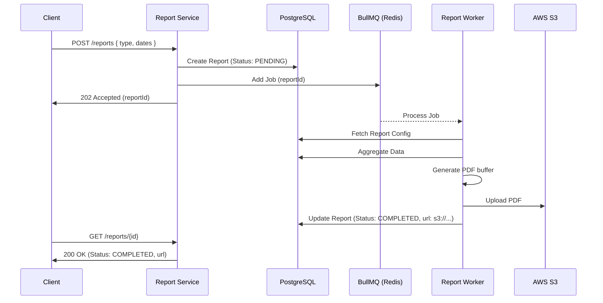

# Report Service

> **IEKB Section:** 03 — Backend  
> **Document:** 10-report-service.md  
> **Last Updated:** 2026-07-16  
> **Owner:** Backend Lead  
> **Status:** Approved

---

## Table of Contents

1. [Overview](#overview)
2. [Asynchronous Generation Flow](#asynchronous-generation-flow)
3. [Service Implementation](#service-implementation)
4. [Report Data Aggregation](#report-data-aggregation)
5. [Related Documents](#related-documents)

---

## Overview

The `ReportService` handles the creation and retrieval of analytical reports (Compliance, Incident Summaries, Asset Health). 

Because PDF generation and complex data aggregation are CPU-intensive and slow, the API **never** generates reports synchronously. Instead, it creates a "Pending" record in the database and delegates the heavy lifting to a background worker via BullMQ.

---

## Asynchronous Generation Flow



---

## Service Implementation

```typescript
// src/modules/reports/report.service.ts
import { prisma } from '@/config/prisma';
import { reportQueue } from '@/queues/report.queue';
import { AppError } from '@/utils/errors';
import type { Prisma } from '@prisma/client';

export class ReportService {
  
  /**
   * Initiates the asynchronous report generation process.
   */
  async requestReport(tenantId: number, userId: number, data: any) {
    // 1. Create a pending record
    const report = await prisma.report.create({
      data: {
        tenantId,
        createdById: userId,
        title: data.title,
        reportType: data.reportType,
        startDate: new Date(data.startDate),
        endDate: new Date(data.endDate),
        status: 'PENDING',
      }
    });

    // 2. Enqueue the job for the background worker
    await reportQueue.add('generate', {
      tenantId,
      reportId: report.id,
      reportType: report.reportType,
      startDate: report.startDate,
      endDate: report.endDate
    }, {
      // Optional: Prevent duplicate identical reports from processing simultaneously
      jobId: `report-${tenantId}-${report.reportType}-${report.startDate.getTime()}`
    });

    // 3. Return the ID so the client can poll for status
    return report;
  }

  /**
   * Retrieves a specific report (used for polling status).
   */
  async getById(tenantId: number, reportId: number) {
    const report = await prisma.report.findFirst({
      where: { id: reportId, tenantId }
    });

    if (!report) throw new AppError('NOT_FOUND', 'Report not found', 404);
    return report;
  }
}

export const reportService = new ReportService();
```

---

## Report Data Aggregation

While the background worker handles the PDF formatting, the data aggregation logic is shared and often lives in a repository or utility file.

Example of data aggregation for an `INCIDENT_SUMMARY` report:

```typescript
// src/modules/reports/aggregators/incident-summary.ts
import { prisma } from '@/config/prisma';

export async function aggregateIncidentSummary(tenantId: number, start: Date, end: Date) {
  // We use raw SQL for complex pivoting, or Prisma grouped queries
  const severityDistribution = await prisma.incident.groupBy({
    by: ['severity'],
    where: { 
      tenantId, 
      createdAt: { gte: start, lte: end },
      deletedAt: null
    },
    _count: { id: true }
  });

  const resolutionTimes = await prisma.$queryRaw`
    SELECT 
      AVG(EXTRACT(EPOCH FROM (resolved_at - created_at))) / 3600 AS avg_resolution_hours,
      severity
    FROM incidents
    WHERE tenant_id = ${tenantId}
      AND resolved_at IS NOT NULL
      AND created_at >= ${start}
      AND created_at <= ${end}
    GROUP BY severity
  `;

  return { severityDistribution, resolutionTimes };
}
```

---

## Related Documents

- **API:** [Report & Dashboard Endpoints](../04-api/07-report-dashboard-endpoints.md)
- **Workers:** [Report Generation Worker](../07-workers/01-report-generation-worker.md)
- **Frontend:** [Reports Pages](../05-frontend/10-reports-pages.md)
- **Index:** [IEKB Master Index](../00-foundation/00-IEKB-index.md)
